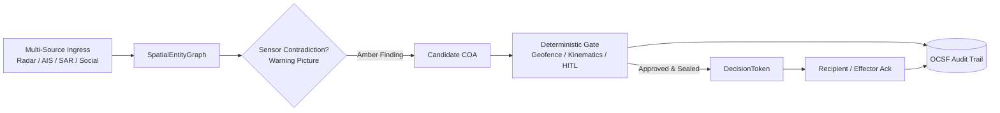

# sdth-nexus-c2

> **Deterministic Command-and-Control (C2) governance engine bridging the Picture-to-Tasking gap.**  
> Built for SDTH 2026 **PS 04 — One Picture, Many Eyes**.

[](https://edgesentry.github.io/sdth-nexus-c2/)

---

### 💡 Executive Summary (At a Glance)

* **What is it?** A C2 governance engine that ingests conflicting sensor feeds, surfaces an **Amber Warning Picture** instead of collapsing data into hallucinated tracks, and deterministically gates actionable tasking to effectors with a cryptographically sealed audit trail.
* **Whose problem?** Operational commanders and C4 evaluators (**DSTA / MINDEF·SAF C4I / MDA**).
* **Which problem?** The **Picture-to-Tasking gap**: operators see merged pictures, but systems fail when tasking real effectors—leading to either dangerous hallucinated tracks from over-fusion or unverified verbal orders without an audit trail.
* **How is it solved?** **Two-Layer Architecture**:
  1. **Probabilistic Layer (`app/`)**: Detects sensor contradictions and constructs a Warning Picture with candidate Courses of Action (COAs).
  2. **Deterministic Layer (`core/` NexusGate)**: Fast-rejects violations (geofence, speed, duplicate), enforces latency-bounded Human-in-the-Loop (HITL) approval, issues a sealed `DecisionToken`, and verifies field effector acknowledgment (`Ack`) logged to an OCSF audit trail.



---

## 1. Whose problem? (The Picture-to-Tasking Gap)

Modern multi-domain operations already have access to merged sensor pictures. Systems break down at the **Picture-to-Tasking handoff**: who authorizes what action, under what policy, against which target, with what verifiable audit trail?

* **Sensor Contradictions:** Sensors differ in clocks, vendor accuracy, and coordinate frames without shared track IDs.
* **The Over-Fusion Trap:** Forcing conflicting signals into a single "fused" picture invents phantom tracks (hallucinations), leading to misallocated assets or kinetic errors.
* **The Under-Processing Trap:** Giving up on automation leaves operators issuing informal verbal orders with zero non-repudiation or tamper-proof logging.

> *We don’t just fuse the picture. We govern the action with deterministic certainty.*

Full planning context: [`docs/plan.md`](docs/plan.md).

---

## 2. Approach: Two-Layer Architecture

NexusGate separates heuristic sensor interpretation from deterministic action governance:

| Layer | Responsibility | Mechanisms |
|-------|----------------|------------|
| **Probabilistic (`app/`)** | Ingest noisy, conflicting feeds → Surface **Warning Picture** | SpatialEntityGraph, heuristic detectors, candidate Course of Action (COA) proposals |
| **Deterministic (`core/`)** | Enforce policy & verify execution → Seal **`DecisionToken`** | Kinematics validation, geofence / speed interlocks (<50ms), latency-bounded HITL, OCSF audit logging |

**Core Philosophy:** We **never** collapse sensor disagreements into a single speculative track. We surface an Amber Warning Picture, demand human confirmation for bounded windows, and govern effector tasking through cryptographically signed tokens.

Closed-loop narrative: [`docs/architecture/index.md`](docs/architecture/index.md).

---

## 3. Operational Scenarios

| ID | Domain & Focus | Sensor Contradiction | Deterministic Tasking |
|----|----------------|----------------------|-----------------------|
| **S1** | **Sea Approach** (Clearance) | Stationary AIS vs. ~20 kt coastal radar/EO | `ISR_IDENTIFY_CONTACT` |
| **S2** | **Air Corridor** (Primary Hero) | Social media claims "3 drones" vs. radar "1 track" + bearing mismatch | `CUE_AND_IDENTIFY`<br/>*(strictly non-kinetic)* |
| **S3** | **Shipping Lane** (Maritime Hero) | Space SAR cluster vs. AIS silence / coastal radar joined via kinematics | `APPROACH_PATROL` |

Scenario details: [`docs/scenarios.md`](docs/scenarios.md). Data provenance (Synthetic / Real-processed / Assumed-mock): [`docs/data-provenance.md`](docs/data-provenance.md).

---

## 4. Architecture & Topology

```text
Laptop Screen 1: Command Cockpit             NexusGate C2 Core (Local / Cloudflare)         Laptop Screen 2: Field Recipient
  - Operator / Commander UI (or TUI)    →      - Ingest & SpatialEntityGraph              ←    - GET /api/recipient/inbox
  - POST /api/gate/proposals (COA)     →      - Deterministic Interlocks (<50ms)         →    - POST /api/recipient/ack
  - POST /api/gate/approve (Operator)  →      - Sealed DecisionToken & OCSF Audit        →    - Optional Effector (USV mock)
```

### Roles
* **Screen 1 (Command Cockpit):** Operational commander workstation to review Amber Findings, inspect COAs, and issue approvals.
* **NexusGate Core:** High-speed deterministic core (graph, kinematics, interlocks, token sealing, audit).
* **Screen 2 (Field Recipient / Effector):** Tactical edge node that polls the inbox, receives sealed tokens, executes orders, and returns an authenticated `Ack`.

### UI Boundary & Live Verification Harness
* **In-Repo Verification Harness (`/verify`):** Embedded Jinja2/HTMX web harness served directly on Core (`:8080`) providing live Screen 1 (`/verify/command`) and Screen 2 (`/verify/recipient`) interfaces for functional verification.
* **BattlePlan Pitch UI:** The external presentation-grade Next.js tactical interface resides in a **separate repository** and consumes this Core's frozen REST contract.

| Screen 1: Command Cockpit (`/verify/command`) | Screen 2: Field Recipient (`/verify/recipient`) |
|:---:|:---:|
|  |  |
| *Amber Warning Picture & Human Operator Approval* | *Field Effector Tasking Inbox & Authenticated Ack* |

Topology details: [`docs/architecture/topology.md`](docs/architecture/topology.md) · REST API contract: [`docs/api/rest.md`](docs/api/rest.md).

---

## 5. Integrations & Pipelines

### External Services & Mocks
| Service | Role | Ports & Modes |
|---------|------|---------------|
| **SIA** (`Sentinel-Imagery-Analysis`) | Sibling repo: Sentinel-1 SAR imagery CV × AIS correlation to isolate dark vessels | Port `:5050` (live push/pull or offline fixture) |
| **GLINT Mock** | Macro corridor scene-difference cluster stub | Port `:5051` (Assumed-mock → live swap Phase 4) |
| **USV Mock** | Effector navigation & telemetry mock | Port `:8000` (optional REST stub) |
| **Cloudflare Containers** | Optional HTTPS cloud deployment of NexusGate Core (`sdth-c2-core`) | Worker front-door + singleton container runtime (`C2_BASE_URL`) |

### Internal Pipelines
* **Dual-SAR Correlation:** Fuses macro corridor scene-diffs (GLINT) with micro SAR vessel detection (SIA) when geodetically aligned.
* **Kinematics Engine:** Projects stale space SAR detections ($T-\Delta t$) to real-time $T_0$ via dead-reckoning envelopes, joining coastal radar tracks without shared MMSI.
* **AIS Data Isolation:** C2 Core **never stores raw AIS data**. Raw AIS stays inside SIA's SQLite database; C2 only ingests uncorrelated dark-vessel `CandidateEvents`.

SAR Pipeline deep-dive: [`docs/architecture/sar_pipeline.md`](docs/architecture/sar_pipeline.md). Cloudflare deployment (`C2_BASE_URL` / `sdth-c2-core`): [`docs/deploy.md`](docs/deploy.md).

---

## 6. Quick Start & Verification

### Step 1: 10-Second CLI Demo (No server needed)

Run directly using `uv` with pre-packaged fixtures:

```bash
uv sync

# Run S1 (Sea approach)
./scripts/demo.sh

# Run S2 (Air corridor hero scenario)
SCENARIO=S2 ./scripts/demo.sh

# Run S3 with stubs and auto-approval
uv run python -m app.main --scenario S3 --stub --yes
```

### Step 2: Interactive Verification Harness (Screen 1 → Core → Screen 2)

Start the local C2 server:

```bash
uv run sdth-c2-server
```

1. Open **Screen 1 (Command)** in your browser: `http://127.0.0.1:8080/verify/command`
   * Click **Propose S2** → Review amber contradiction → Click **Approve**.
2. Open **Screen 2 (Recipient)**: `http://127.0.0.1:8080/verify/recipient`
   * View dispatched `DecisionToken` in inbox → Click **Ack**.
3. Observe real-time OCSF audit log updated with `recipient_ack`.

*One-shot script equivalent:* `./scripts/picture_to_tasking.sh`

### Step 3: Full-Stack Demonstration (SIA + GLINT + AIS → C2)

```bash
# Launch SIA (:5050), GLINT mock (:5051), and C2 server (:8080)
uv run python scripts/sentinel_ais_correlate.py \
  --scan 20260916_224721_162544676155 \
  --ais-source demo \
  --ingest-c2 --reset-c2

# Then in /verify: Propose S3 → Approve → Ack
```

E2E test matrix & Dual-SAR comparisons: [`docs/verify-e2e.md`](docs/verify-e2e.md) · Extended demos: [`docs/demo.md`](docs/demo.md).

---

## 7. Automated Tests & Benchmarks

```bash
# Fast unit tests
uv run pytest tests/unit/ -q

# Integration test suite
uv run pytest tests/integration/ -v -m integration

# Latency & gate verification benchmark (Slide 11 proof: <50ms gate + Ack audit)
uv run python scripts/benchmark.py
```

*Continuous Integration (CI) runs unit, integration, benchmark, temporal streamer, and container smoke checks on every pull request.*

---

## 8. Operating Boundaries & Limits

* **Deterministic Gate Authority:** Probabilistic models / LLMs may only propose candidate COAs; **only the deterministic NexusGate** can seal a `DecisionToken`.
* **Harness Scope:** `/verify` is a functional test harness (Jinja2/HTMX), not a full production GIS map.
* **Non-Kinetic Scope:** Scenario S2 cues identification only; kinetic engagements are strictly excluded.
* **In-Memory Architecture:** C2 Core maintains state in-memory with append-only JSONL audit logs. AIS historical tracking is delegated to SIA SQLite.

---

## 9. Documentation Map

| Topic | Documentation Link |
|-------|--------------------|
| **Executive 1-Pager** | [`docs/one-pager.md`](docs/one-pager.md) |
| **Architectural Narrative** | [`docs/architecture/index.md`](docs/architecture/index.md) |
| **System Topology & Hardware I/O** | [`docs/architecture/topology.md`](docs/architecture/topology.md) |
| **Space SAR & Dual-SAR Pipeline** | [`docs/architecture/sar_pipeline.md`](docs/architecture/sar_pipeline.md) |
| **Scenarios & Provenance** | [`docs/scenarios.md`](docs/scenarios.md) · [`docs/data-provenance.md`](docs/data-provenance.md) |
| **Frozen C2 REST Contract** | [`docs/api/rest.md`](docs/api/rest.md) |
| **E2E Verification Matrix** | [`docs/verify-e2e.md`](docs/verify-e2e.md) |
| **Cloudflare Containers & LiteLLM** | [`docs/deploy.md`](docs/deploy.md) · [`docs/litellm.md`](docs/litellm.md) |
| **Roadmap & Master Plan** | [`docs/roadmap.md`](docs/roadmap.md) · [`docs/plan.md`](docs/plan.md) |

Hosted Documentation: **[edgesentry.github.io/sdth-nexus-c2](https://edgesentry.github.io/sdth-nexus-c2/)**
