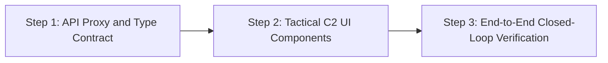

# Architecture Proposal: ARCHVIEW Tactical Console & NexusGate C2 Core Integration

> **SDTH 2026 PS 04 — One Picture, Many Eyes (From Picture to Tasking)**  
> **Topic:** Why the Tactical Operator UI ([ARCHVIEW](https://github.com/johnnyteoh8888/SDTH-2026)) stays decoupled from the Deterministic C2 Governance Engine ([MOSAIC NexusGate](https://github.com/edgesentry/sdth-nexus-c2)).

Closed-loop principles: [Closed loop](index.md). Screen / process placement: [Topology](topology.md). Frozen REST & types: [`rest.md`](../api/rest.md) · [`archview-types.ts`](../api/archview-types.ts). E2E runbook: [Path ARCHVIEW](../verify-e2e.md#path-archview-hero-s3--issue-99).

---

## 1. Executive Summary

This proposal evaluates whether to combine the codebases into a single monolithic application or to establish a decoupled, contract-driven architecture where:

1. **The Tactical Console** ([ARCHVIEW](https://github.com/johnnyteoh8888/SDTH-2026)) specializes in the **Screen 1 Command Cockpit & Tactical Operator Experience (UI/UX)** grounded in defense operational doctrine.
2. **The C2 Core Engine** ([MOSAIC NexusGate](https://github.com/edgesentry/sdth-nexus-c2)) specializes in **Multi-Sensor Ingress, Dynamic Ontology, Contradiction Detection, Deterministic Gating, OCSF Tamper-Proof Auditing, and Effector Tasking**.

### Recommendation: Decoupled Integration

**We recommend a decoupled integration model.** Rather than rewriting or folding all logic into a single repository, the project achieves maximum velocity and domain credibility by establishing a clear separation of concerns:

* **Tactical Console (Front-End Lead / Defense Operations):** Focuses exclusively on the operator cockpit, military-grade map symbology, situational awareness presentation, and Rules of Engagement (ROE) workflow.
* **C2 Core Engine (AI Platform / Systems Lead):** Serves as the sovereign, high-throughput verification backend executing sensor graph management, probabilistic contradiction detection, deterministic safety interlocks (<50 ms), cryptographic token sealing (**SHA-256** DecisionToken / OCSF hash chain for this epic; Ed25519 is out of scope — see [Client binding](../api/rest.md#client-binding-phase-3)), and field actuator communication.

---

## 2. Strategic Rationale

### 2.1 Leveraging Defense Operational Domain Expertise

The project's Defense Operations Lead brings active-duty military and defense technology expertise (MINDEF / SAF operational background, tactical communications, and C2 workflows).

Having this lead focus on the **Command Console UI/UX and Operational Realism** delivers the highest strategic advantage:

* Evaluators from defense and homeland security agencies (DSTA, SAF C4I, HTX, SMCC/MSTF) judge C2 systems based on operational fidelity, clear priority escalations, and adherence to military doctrine.
* Offloading low-level cryptographic hashing, kinematic physics validation, and asynchronous queuing to the backend frees the defense expert to focus on tactical symbology (MIL-STD/APP-6), situational clarity, and authentic maritime conflict workflows (e.g., Singapore Strait TSS / Dark Vessel interdiction).

### 2.2 Perfect Complementarity of Scopes

The stated design boundaries of both repositories demonstrate zero overlap and complete alignment:

| Capability Layer | Tactical Console ([ARCHVIEW](https://github.com/johnnyteoh8888/SDTH-2026)) | C2 Core Engine ([NexusGate](https://github.com/edgesentry/sdth-nexus-c2)) |
| :--- | :--- | :--- |
| **Primary Scope** | Evidence review, dark-themed BattlePlan map interface, manual review tracking. | Deterministic C2 governance bridging the Picture-to-Tasking handoff gap. |
| **Documented Boundaries** | Explicitly excludes: military tasking, effector control, tactical fusion, strike impact, tamper-proof logging, guaranteed latency. | Directly implements: candidate COA generation, sub-50ms deterministic interlocks, sealed `DecisionToken`, OCSF audit chain, effector Ack loops. |
| **Tech Stack** | Modern React, TypeScript, Leaflet, Lucide icons, Vite (`127.0.0.1:3001`). | High-performance Python, FastAPI, Pydantic, SHA-256 OCSF chain, DuckDB. |
| **Role in Pitch** | **Screen 1: Command Cockpit** (Visual centerpiece for VIP evaluators). | **C2 Governance Backbone** (The non-bypassable policy and audit spine). |

Physical Screen 1 / Core / Screen 2 placement and dual-tier UI (`/verify` vs ARCHVIEW): [Topology](topology.md).

---

## 3. Team Synergy & Work Breakdown

| Functional Area | Assigned Lead | Core Deliverables |
| :--- | :--- | :--- |
| **Tactical Console & Operator UX** | **Defense Operations & Comms Lead** | • ARCHVIEW React front-end refinement. • Tactical symbology (MIL-STD/APP-6 style). • Operational scenario design and ROE validation. • HITL countdown and approval UX. |
| **C2 Engine & Platform Core** | **AI Platform Architect** | • FastAPI backend optimization and CORS configuration. • `SpatialEntityGraph` and contradiction heuristics. • Deterministic safety interlocks (<50 ms) & SHA-256 token sealing. • OCSF tamper-evident audit chain (`GET /api/audit/health`). • Effector inbox/ack distribution API. |
| **Geospatial & Sensor Fusion** | **Geospatial Analytics Lead** | • Singapore Strait traffic separation scheme (TSS) corridors. • Coordinate frame harmonization (WGS84, SVY21). • Sensor FOV geometry and clock-drift correction. |
| **AI Inference & Object Detection** | **AI / Object Detection Lead** | • Dark vessel / UAV YOLO detection pipeline. • Confidence scoring and Observation normalization. |
| **Embedded Edge & Physical Effector** | **Embedded Hardware Lead** | • Screen 2: Raspberry Pi 5 node and physical actuator. • Effector polling (`/api/recipient/inbox`) and execution Ack. |

---

## 4. Execution Roadmap

### Step 1: API Proxy & Type Contract

* Wire Vite (`127.0.0.1:3001`) to Core (`:8080`) without colliding with ARCHVIEW's evidence BFF (`:3102`) — path splits or `/c2` prefix (#95). Details: [ARCHVIEW connection](../api/rest.md#archview-connection).
* Consume [`archview-types.ts`](../api/archview-types.ts) (`operator_id`, ontology `alert` vs finding `amber_alert`).

### Step 2: Tactical C2 UI Components

Product intent only (contracts live in `rest.md`):

* **Amber Warning Banner** — surface sensor discrepancy without inventing a fused track.
* **HITL Decision Card** — countdown, lead intercept (Lat/Lon/Bearing/Speed/ETA), Approve/Deny.
* **Evidence Inspector** — dual-SAR chips / optical boxes from Core.
* **Audit health pill** — `GET /api/audit/health`.

### Step 3: End-to-End Closed-Loop Verification

Do not duplicate the checklist here. Run: **[Path ARCHVIEW](../verify-e2e.md#path-archview-hero-s3--issue-99)** ([#99](https://github.com/edgesentry/sdth-nexus-c2/issues/99); Demo [Path G](../demo.md#demo-path-g-archview-tactical-console-issue-99)).
