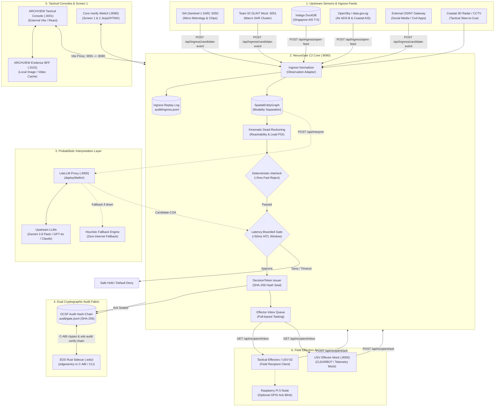
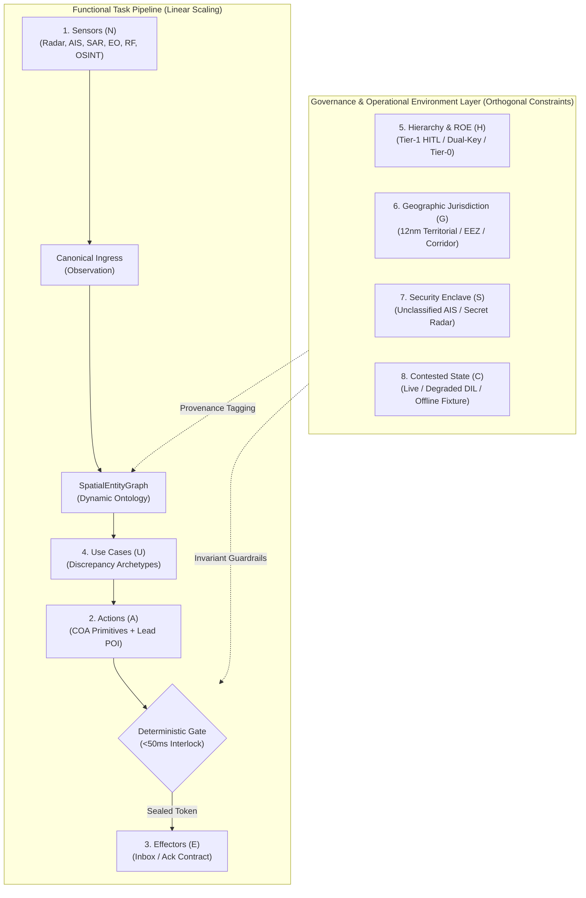
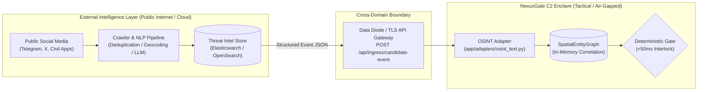

# Closed loop

| Doc | Owns |
|-----|------|
| **This page** | Probabilistic vs deterministic principles, Finding meaning, 8 orthogonal dimensions, OSINT ingress boundary |
| [Topology](topology.md) | Screen 1 / Core / Screen 2 placement, dual-tier UI, Cloudflare deploy |
| [Space SAR Pipeline](sar_pipeline.md) | SAR×AIS upstream, Dual-SAR, 3-tier cognitive load, sovereign target architecture |
| [ARCHVIEW Integration](archview-integration-proposal.md) | Why UI stays decoupled (decision, RACI, roadmap intent) — not API or E2E SoT |
| [REST](../api/rest.md) · [verify-e2e](../verify-e2e.md) | Frozen contract · executable runbooks |

NexusGate splits **probabilistic interpretation** (app layer) from **deterministic gating** (core):

1. **Probabilistic** — noisy, conflicting feeds (social OSINT, radar, EO blur, AIS, RF) become a Warning Picture / candidate COA.
2. **Deterministic** — kinematic corroboration, geofence/speed interlocks, latency-bounded HITL, sealed `DecisionToken`, immutable OCSF audit.

## Complete System Integration Architecture

NexusGate C2 operates as the deterministic anchor in a distributed tactical ecosystem. The diagram below illustrates every integration point across upstream sensors, probabilistic inference, sovereign security sidecars, tactical consoles, and field effectors:



---

## Exhaustive Integration Matrix

NexusGate Core establishes structured, contract-bound interfaces with 12 distinct components across the intelligence-to-action cycle:

| # | Integration Category | Target Component | Wire Protocol / Endpoint | Port / Transport | Operational Role | Fallback / Fail-Safe State |
|---|---|---|---|---|---|---|
| **1** | **Micro SAR Metrology** | `Sentinel-Imagery-Analysis` (SIA) | `POST /api/ingress/candidate-event` (`pull_upstream` / `run_cv`) | HTTP `:5050` / Local LAN | Physical vessel length/beam OBB & radar chips ($L=78.2\text{m}, 52.0\text{m}$). | Automatic fail-safe to `tests/fixtures/sentinel_run_cv_sg_strait.json`. |
| **2** | **Macro SAR Cluster** | Team 02 GLINT | `POST /api/ingress/candidate-event` (`pull_glint`) | HTTP `:5051` / REST | Corridor-level statistical change detection & dark cluster warnings. | Automatic fallback to GLINT assumed fixture (`glint_fixture`). |
| **3** | **Dual-SAR Synergy** | Dual-SAR Corroborator (`dual_sar.py`) | `POST /api/ingress/candidate-event` (`dual_sar` / `pull_dual_sar`) | In-memory sync | Fuses GLINT corridor cue with SIA micro metrology (boosts confidence to 0.98). | Degrades to `source=sia_only` if macro cannot overlap. |
| **4** | **Maritime AIS Ground Truth** | Indago Stream Engine | `POST /api/ingress/open-feed` (`feed=ais`, `source=indago`) | DuckDB IPC (`~/.indago/...`) | Live commercial vessel tracks in Singapore Strait ($T \approx 0$). | Falls back to `data.gov.sg` live poll $\to$ golden fixture (`open_ais_datagovsg.json`). |
| **5** | **Air / Surface Open Feeds** | OpenSky Network / data.gov.sg | `POST /api/ingress/open-feed` (`feed=air`) | HTTPS REST | Live ADS-B airspace tracking and coastal open telemetry. | Falls back to deterministic fixture (`open_air_traffic.json`). |
| **6** | **OSINT Text Intelligence** | External Scraper Gateway (єВорог / Telegram) | `POST /api/ingress/candidate-event` (OSINT adapter) | TLS REST / Air-gap diode | Structured civilian reports and threat claims (S2 air swarm). | Fixed scenario events via `core.scenarios.s2`. |
| **7** | **Probabilistic LLM Engine** | LiteLLM Proxy (`deploy/litellm/`) | `POST /api/interpret` | HTTP `:4000` / OpenAI Wire Spec | Generates contextual hypotheses & candidate COAs via Gemini 3.8 Flash, GPT-4o, or Claude. | Automatic fallback to rule-based heuristic interpreter (`source=heuristic`). |
| **8** | **Tactical Console (Screen 1)** | ARCHVIEW Frontend | Vite Proxy (`/api/*` $\to$ `:8080`) | HTTP `:3001` (Vite) / `:3102` (BFF) | Primary tactical display for VIP evaluators: Amber alert, map tracks, HITL approval. | Zero-dependency Core WebUI (`/verify/command`). |
| **9** | **Core Verification WebUI** | In-Repo Verify Harness | Server-Rendered Jinja2 + HTMX | HTTP `:8080` (`/verify`) | Zero-dependency verification harness on Core for Screen 1 & Screen 2 testing. | Headless CLI (`scripts/picture_to_tasking.py`). |
| **10** | **Field Effector Tasking** | Tactical Effector Node (USV / MPA) | `GET /api/recipient/inbox`<br>`POST /api/recipient/ack` | HTTP `:8080` (REST) | Pull-based asynchronous task distribution and signed execution acknowledgment. | Simulated via curl / CLI runner. |
| **11** | **USV Effector Simulator** | Mock Effector Service (`mocks/usv.py`) | `/api/v1/telemetry`<br>`/api/v1/task` | HTTP `:8000` (`EFFECTOR_BASE_URL`) | Simulates physical USV waypoint navigation, battery telemetry, and autonomous patrol state. | Internal inbox polling loop without physical effector. |
| **12** | **Cryptographic Audit Fabric** | EDS Rust Sidecar (`edgesentry-rs`) | C-ABI ctypes bridge (`.eds/`)<br>`eds audit verify-chain` | In-process C-ABI + Subprocess CLI | Out-of-process dual-chain verification: Primary OCSF SHA-256 + Secondary BLAKE3/Postcard. | Pure Python SHA-256 hash-chain verification (`core/audit.py`). |
| **13** | **Sensor Ingress Replay** | Ingress Replay Engine (`ingress_replay.py`) | JSONL Append (`.audit/ingress.jsonl`) | Local Disk I/O | Records raw incoming sensor payloads for zero-loss tactical debrief and replay. | Non-blocking best-effort logging. |

---

## Decision path (code)

```text
build_events()  →  SpatialEntityGraph
        →  detect() → Finding | None
        →  build_coa() → CourseOfAction (Tier-1 HITL)
        →  LatencyBoundedGate.evaluate()
              fast-reject (<5ms) → Geofence / Speed / Duplicate
              approve (<50ms)   → DecisionToken → Recipient
              deny / timeout    → Default = Deny
        →  Recipient Ack → AuditLogger seals Token & Ack
```

## Warning Picture (`Finding`)

| Field | Meaning |
|-------|---------|
| `threat_class` | e.g. `attritable_air_incursion` |
| `warning_minutes_est` | Tactical minutes remaining |
| `mismatch_m` | Spatial disagreement between sources |
| `confidence` | Rule-composed score (0.0 to 1.0) |
| `picture_summary` | Single operational summary |
| `adversarial_hypothesis` | “If source X is false…” |
| `amber_alert` | e.g. `COUNT_AND_BEARING_MISMATCH` |
| `source_breakdown` | Claims by modality |

Core never invents a fused track when sensors disagree — it surfaces the contradiction, then gates action.

---

## Extensibility & Scaling: 8 Orthogonal Dimensions

A common failure mode in C2 engineering is **combinatorial complexity**: as sensor types, tactical actions, effectors, mission scenarios, and operational rules grow, naive architectures scale exponentially as $\mathcal{O}(N \times A \times E \times U \times \dots)$, requiring bespoke cross-conversion code for every permutation.

NexusGate prevents implementation explosion by decomposing the C2 problem into **eight orthogonal boundaries** across two tiers: **Functional Pipeline (I/O & Tasks)** and **Governance & Operational Environment**. This reduces architectural complexity to strictly linear scaling:

$$\mathcal{O}(N + A + E + U + H + G + S + C)$$



---

### A. Functional Task Pipeline Dimensions

| Dimension | What Changes | Why Complexity Does NOT Explode | Where Code Is Added |
|---|---|---|---|
| **1. Sensor Inputs ($N$)** | Acoustic sonar, satellite optical, cyber signal, OSINT text | **Ingress Normalization ($\mathcal{O}(N)$)**: An adapter maps the feed into the canonical [`Observation`](../api/rest.md) structure. The core graph handles spatial and temporal correlation automatically via physics (Haversine & Dead-Reckoning); zero cross-sensor mapping matrices ($N \times M$) are needed. Upstream crawling and CV inference remain strictly externalized. | `app/adapters/<sensor>.py` |
| **2. Actions ($A$)** | Warning flare, jamming, civilian evacuation cue | **COA Primitives ($\mathcal{O}(A)$)**: Actions are modeled as standard tactical intents (`target_coordinates`, `action_type`, `tier`, `vectoring`). Intercept geometry is resolved centrally by [`core/kinematics.py`](sar_pipeline.md#23-dual-sar-synergy-temporal-kinematic-bridge) rather than re-engineered per action. | [`core/coa.py`](../api/rest.md#post-apigateproposals) |
| **3. Field Effectors ($E$)** | USV, MPA aircraft, shore battery, municipal police | **Recipient Ack Contract ($\mathcal{O}(E)$)**: Core never communicates directly with hardware actuators. It delivers cryptographically sealed `DecisionTokens` via a pull-based inbox (`GET /api/recipient/inbox`) and awaits signed Ack (`POST /api/recipient/ack`). Physical actuation protocol conversion lives at the edge. | Edge effector client |
| **4. Use Cases ($U$)** | Counter-piracy, illegal fishing, contested airspace | **Discrepancy Archetypes ($\mathcal{O}(U)$)**: Operational contradictions naturally reduce to 4 mathematical primitives (*Presence vs Silence*, *Kinematic Velocity*, *Count*, and *Spatial Offset*). New scenarios simply map these primitives to COA intents via declarative policies or probabilistic proposers ([`app/llm_interpreter.py`](../litellm.md)). | `app/scenarios/` or declarative policy |

---

### B. Governance & Operational Environment Dimensions

| Dimension | What Changes | Why Complexity Does NOT Explode | Where Policy Is Configured |
|---|---|---|---|
| **5. Hierarchy & ROE ($H$)** | Tier-1 operator approval, Tier-2 dual-key commander sign-off, Tier-0 automated kinetic defense | **Multi-Tier Gate Engine**: Authority logic is decoupled from tactical action code. [`core/gate.py`](../api/rest.md#post-apigateapprove) enforces approval windows, required operator keys, and latency limits based strictly on the COA's `tier` field. | Gate policy / approval config |
| **6. Geographic Jurisdiction ($G$)** | Singapore Strait TSS, 12nm territorial waters, 200nm EEZ, flight corridors | **Spatial Interlock Policy**: Legal boundaries (UNCLOS, municipal zones) are maintained as polygon attributes in [`core/interlock.py`](../api/rest.md). Spatial rules fast-reject unauthorized actions without modifying scenario logic. | Geofence geojson / polygon registry |
| **7. Security & Multi-Tenancy ($S$)** | Unclassified open AIS, sovereign classified 3D radar, cross-domain coalition feeds | **Cryptographic Enclaves & Provenance**: Raw observations carry source clearance tags. The in-memory graph computes contradictions across enclaves, while the immutable OCSF hash chain seals decision tokens without leaking classified telemetry. | `Observation.attributes` + OCSF audit |
| **8. Contested & DIL States ($C$)** | Peacetime high-bandwidth, GPS jamming/spoofing, disconnected/intermittent/limited (DIL) | **Degraded Mode Ladder**: Each subsystem has an automatic fail-safe fallback (e.g., Live API $\to$ Indago DuckDB $\to$ Golden Fixtures; Cloudflare $\to$ Local laptop Core). The deterministic gate executes locally even under complete network severance. | Ingress adapters & runtime fallbacks |

---

### Ingress Boundaries: Why C2 Does Not Scrape Raw OSINT / Social Media

A fundamental tenet of NexusGate is the strict separation between **Intelligence Collection/Filtering** (upstream services) and **Tactical Action Gating** (C2 Core):



| Question | Architectural Decision | Operational Rationale |
|---|---|---|
| **Does C2 crawl social media directly?** | **No.** Social media crawling is strictly externalized to specialized threat intelligence platforms. | **Air-gap & Enclave Security**: Military C2 cores run inside restricted or air-gapped enclaves (e.g. SIPRNet, tactical edge servers) that prohibit direct outbound internet scraping. |
| **Why not run scrapers / full NLP in C2?** | Heavy multi-modal NLP, video OCR, and bot-mitigation pipelines run asynchronously upstream. | **Deterministic Latency Budget**: 99.9% of social chatter is noise, spam, or disinfo. Crawling firehoses would destroy C2's sub-50ms deterministic gate guarantee. |
| **How does OSINT enter C2?** | Via normalized ingress adapters ([`app/adapters/osint_text.py`](../data-provenance.md#inventory)). | **Canonical Contract**: Upstream services distill raw chatter into structured claims (`timestamp`, `lat/lon`, `count=3`, `confidence=0.72`) which map into canonical `Observation` objects. |
| **Current Mock vs. Production Reality** | Current repo uses synthetic text fixtures and regex/NLP parsers ([#59](https://github.com/edgesentry/sdth-nexus-c2/issues/59)). | In production, the adapter ingests structured event JSON from external feeds (e.g., Dataminr, Primer, or civil defense intake apps like Ukraine's *єВорог*). See [Data Provenance](../data-provenance.md) and [Scenarios (S2)](../scenarios.md). |

---

### Key Architectural Invariants Under Scale
1. **No Data Fusion Loss**: Because observations remain discrete in the graph, new use cases can leverage raw modality claims without being blinded by premature track blending.
2. **Immutable Gate Rules**: Adding 50 new sensors or 20 new effectors does not alter the deterministic fast-reject safety rules (<50ms geofence, velocity clamps, duplicate suppression). Safety constraints remain constant regardless of operational scale.
3. **Decoupled Data Storage & Ingestion**: Heavy historical persistence ([Indago / ClickHouse](sar_pipeline.md#24-decoupled-3-tier-architecture-cognitive-load-compression)) and raw intelligence gathering (social media web scraping, raster CV) are absorbed by external upstream systems. The C2 decision engine remains strictly in-memory, state-bounded, and deterministic.
