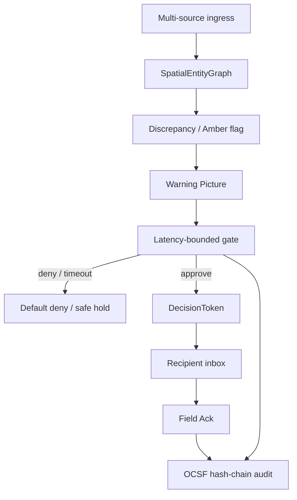

# Closed loop

NexusGate splits **probabilistic interpretation** (app layer) from **deterministic gating** (core):

1. **Probabilistic** — noisy, conflicting feeds (social OSINT, radar, EO blur, AIS, RF) become a Warning Picture / candidate COA.
2. **Deterministic** — kinematic corroboration, geofence/speed interlocks, latency-bounded HITL, sealed `DecisionToken`, immutable OCSF audit.

## End-to-end path



## Decision path (code)

```text
build_events()  →  SpatialEntityGraph
        →  detect() → Finding | None
        →  build_coa() → CourseOfAction (Tier-1 HITL)
        →  LatencyBoundedGate.evaluate()
              fast-reject (<5ms) → Geofence / Speed / Duplicate
              approve (<50ms)   → DecisionToken → Recipient
              deny / timeout    → Default = Deny
        →  Recipient Ack → AuditLogger seals Token & Ack
```

## Warning Picture (`Finding`)

| Field | Meaning |
|-------|---------|
| `threat_class` | e.g. `attritable_air_incursion` |
| `warning_minutes_est` | Tactical minutes remaining |
| `mismatch_m` | Spatial disagreement between sources |
| `confidence` | Rule-composed score (0.0 to 1.0) |
| `picture_summary` | Single operational summary |
| `adversarial_hypothesis` | “If source X is false…” |
| `amber_alert` | e.g. `COUNT_AND_BEARING_MISMATCH` |
| `source_breakdown` | Claims by modality |

Core never invents a fused track when sensors disagree — it surfaces the contradiction, then gates action.
