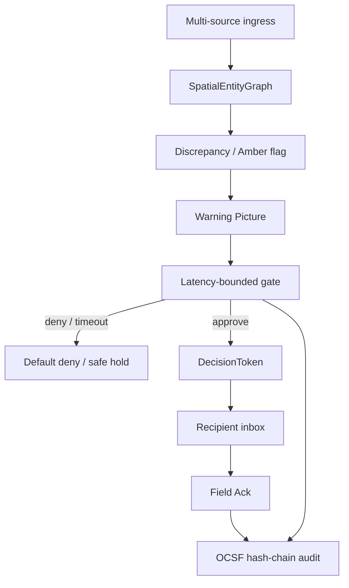
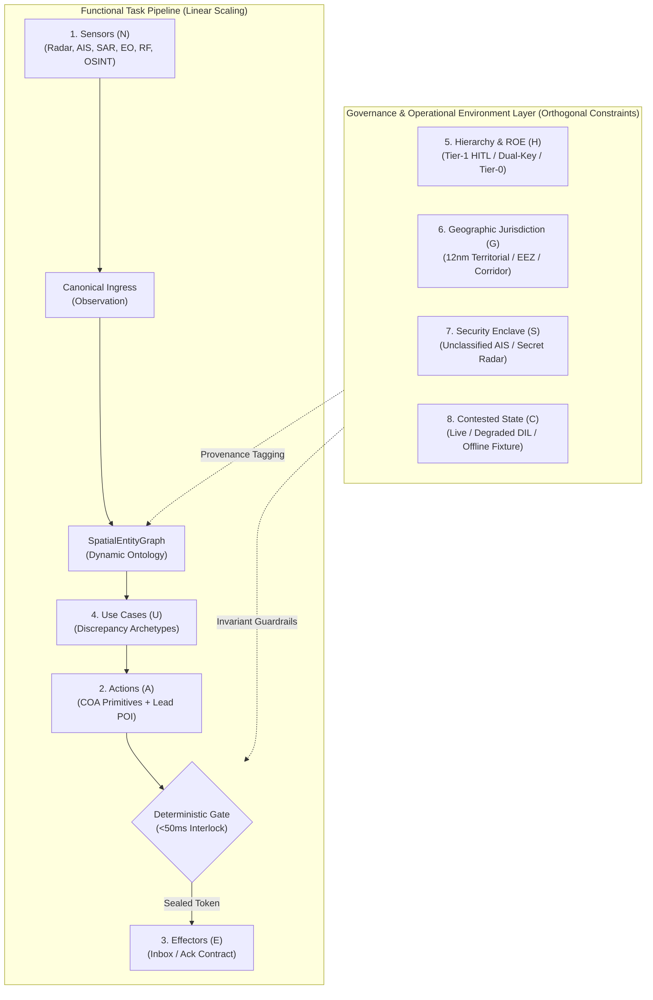

# Closed loop

NexusGate splits **probabilistic interpretation** (app layer) from **deterministic gating** (core):

1. **Probabilistic** — noisy, conflicting feeds (social OSINT, radar, EO blur, AIS, RF) become a Warning Picture / candidate COA.
2. **Deterministic** — kinematic corroboration, geofence/speed interlocks, latency-bounded HITL, sealed `DecisionToken`, immutable OCSF audit.

## End-to-end path



## Decision path (code)

```text
build_events()  →  SpatialEntityGraph
        →  detect() → Finding | None
        →  build_coa() → CourseOfAction (Tier-1 HITL)
        →  LatencyBoundedGate.evaluate()
              fast-reject (<5ms) → Geofence / Speed / Duplicate
              approve (<50ms)   → DecisionToken → Recipient
              deny / timeout    → Default = Deny
        →  Recipient Ack → AuditLogger seals Token & Ack
```

## Warning Picture (`Finding`)

| Field | Meaning |
|-------|---------|
| `threat_class` | e.g. `attritable_air_incursion` |
| `warning_minutes_est` | Tactical minutes remaining |
| `mismatch_m` | Spatial disagreement between sources |
| `confidence` | Rule-composed score (0.0 to 1.0) |
| `picture_summary` | Single operational summary |
| `adversarial_hypothesis` | “If source X is false…” |
| `amber_alert` | e.g. `COUNT_AND_BEARING_MISMATCH` |
| `source_breakdown` | Claims by modality |

Core never invents a fused track when sensors disagree — it surfaces the contradiction, then gates action.

---

## Extensibility & Scaling: 8 Orthogonal Dimensions

A common failure mode in C2 engineering is **combinatorial complexity**: as sensor types, tactical actions, effectors, mission scenarios, and operational rules grow, naive architectures scale exponentially as $\mathcal{O}(N \times A \times E \times U \times \dots)$, requiring bespoke cross-conversion code for every permutation.

NexusGate prevents implementation explosion by decomposing the C2 problem into **eight orthogonal boundaries** across two tiers: **Functional Pipeline (I/O & Tasks)** and **Governance & Operational Environment**. This reduces architectural complexity to strictly linear scaling:

$$\mathcal{O}(N + A + E + U + H + G + S + C)$$



---

### A. Functional Task Pipeline Dimensions

| Dimension | What Changes | Why Complexity Does NOT Explode | Where Code Is Added |
|---|---|---|---|
| **1. Sensor Inputs ($N$)** | Acoustic sonar, satellite optical, cyber signal | **Ingress Normalization ($\mathcal{O}(N)$)**: An adapter maps the feed into the canonical [`Observation`](../api/rest.md) structure. The core graph handles spatial and temporal correlation automatically via physics (Haversine & Dead-Reckoning); zero cross-sensor mapping matrices ($N \times M$) are needed. | `app/adapters/<sensor>.py` |
| **2. Actions ($A$)** | Warning flare, jamming, civilian evacuation cue | **COA Primitives ($\mathcal{O}(A)$)**: Actions are modeled as standard tactical intents (`target_coordinates`, `action_type`, `tier`, `vectoring`). Intercept geometry is resolved centrally by [`core/kinematics.py`](sar_pipeline.md#23-dual-sar-synergy-temporal-kinematic-bridge) rather than re-engineered per action. | [`core/coa.py`](../api/rest.md#post-apigateproposals) |
| **3. Field Effectors ($E$)** | USV, MPA aircraft, shore battery, municipal police | **Recipient Ack Contract ($\mathcal{O}(E)$)**: Core never communicates directly with hardware actuators. It delivers cryptographically sealed `DecisionTokens` via a pull-based inbox (`GET /api/recipient/inbox`) and awaits signed Ack (`POST /api/recipient/ack`). Physical actuation protocol conversion lives at the edge. | Edge effector client |
| **4. Use Cases ($U$)** | Counter-piracy, illegal fishing, contested airspace | **Discrepancy Archetypes ($\mathcal{O}(U)$)**: Operational contradictions naturally reduce to 4 mathematical primitives (*Presence vs Silence*, *Kinematic Velocity*, *Count*, and *Spatial Offset*). New scenarios simply map these primitives to COA intents via declarative policies or probabilistic proposers ([`app/llm_interpreter.py`](../litellm.md)). | `app/scenarios/` or declarative policy |

---

### B. Governance & Operational Environment Dimensions

| Dimension | What Changes | Why Complexity Does NOT Explode | Where Policy Is Configured |
|---|---|---|---|
| **5. Hierarchy & ROE ($H$)** | Tier-1 operator approval, Tier-2 dual-key commander sign-off, Tier-0 automated kinetic defense | **Multi-Tier Gate Engine**: Authority logic is decoupled from tactical action code. [`core/gate.py`](../api/rest.md#post-apigateapprove) enforces approval windows, required operator keys, and latency limits based strictly on the COA's `tier` field. | Gate policy / approval config |
| **6. Geographic Jurisdiction ($G$)** | Singapore Strait TSS, 12nm territorial waters, 200nm EEZ, flight corridors | **Spatial Interlock Policy**: Legal boundaries (UNCLOS, municipal zones) are maintained as polygon attributes in [`core/interlock.py`](../api/rest.md). Spatial rules fast-reject unauthorized actions without modifying scenario logic. | Geofence geojson / polygon registry |
| **7. Security & Multi-Tenancy ($S$)** | Unclassified open AIS, sovereign classified 3D radar, cross-domain coalition feeds | **Cryptographic Enclaves & Provenance**: Raw observations carry source clearance tags. The in-memory graph computes contradictions across enclaves, while the immutable OCSF hash chain seals decision tokens without leaking classified telemetry. | `Observation.attributes` + OCSF audit |
| **8. Contested & DIL States ($C$)** | Peacetime high-bandwidth, GPS jamming/spoofing, disconnected/intermittent/limited (DIL) | **Degraded Mode Ladder**: Each subsystem has an automatic fail-safe fallback (e.g., Live API $\to$ Indago DuckDB $\to$ Golden Fixtures; Cloudflare $\to$ Local RasPi Core). The deterministic gate executes locally even under complete network severance. | Ingress adapters & runtime fallbacks |

---

### Key Architectural Invariants Under Scale
1. **No Data Fusion Loss**: Because observations remain discrete in the graph, new use cases can leverage raw modality claims without being blinded by premature track blending.
2. **Immutable Gate Rules**: Adding 50 new sensors or 20 new effectors does not alter the deterministic fast-reject safety rules (<50ms geofence, velocity clamps, duplicate suppression). Safety constraints remain constant regardless of operational scale.
3. **Decoupled Data Storage**: Ingestion scaling is absorbed by external streaming and storage planes ([Indago / ClickHouse](sar_pipeline.md#24-decoupled-3-tier-architecture-cognitive-load-compression)), keeping the C2 decision engine strictly in-memory and state-bounded.
