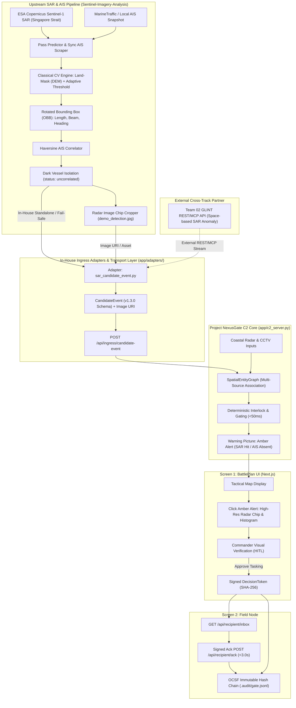
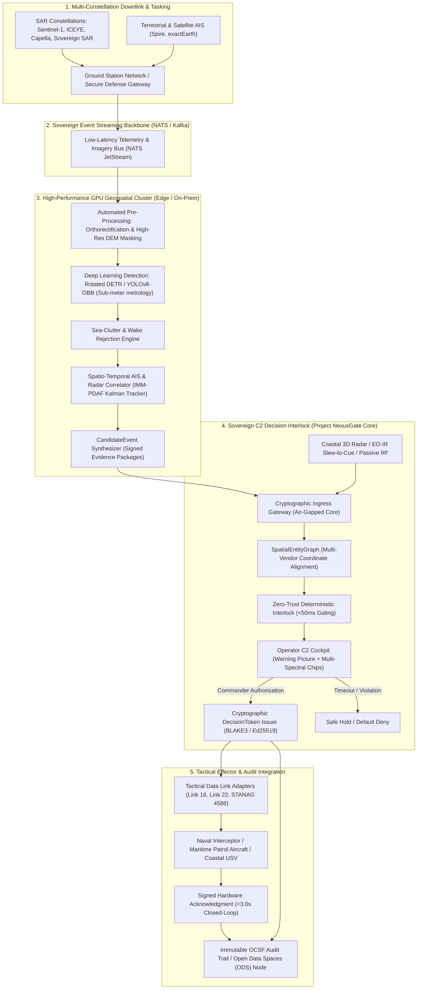

# Space-based SAR Pipeline & Production Architecture

This document specifies the integration of space-based Synthetic Aperture Radar (SAR) and maritime intelligence feeds into **Project NexusGate C2 Core**, spanning both **Immediate Hackathon Operations** and the **Target Production Sovereign Architecture**.

---

## 1. Executive Summary & Problem Context

In **SDTH 2026 PS 04 ("One Picture, Many Eyes")**, **Scenario S3** addresses coastal and shipping lane anomalies where maritime traffic operates outside standard cooperative reporting (AIS). 

Space-based SAR provides all-weather, day-and-night macro sea surveillance. However, operationalizing raw satellite radar imagery into actionable command tasking faces two major hurdles:
1. **The Ingestion & Metrology Gap**: Raw radar scenes are gigabytes in size and contain sea clutter, wave crests, and coastal noise. Converting pixels into discrete, physical kinematic records (length, beam, heading) without false alarms requires disciplined preprocessing.
2. **The Decision & Verification Gap**: Presenting radar blips to an operator without cross-correlating against cooperative AIS feeds creates visual confusion. Operators must see **why** a contact is anomalous (e.g., radar return present, AIS absent, coastal CCTV corroboration pending) before authorizing an interceptor or patrol USV.

To resolve this, the C2 architecture integrates an upstream **SAR × AIS Correlation Engine** ([`Sentinel-Imagery-Analysis`](https://github.com/StrixGoldhorn/Sentinel-Imagery-Analysis)) feeding structured, verified evidence packages into the NexusGate deterministic gating engine.

**Phase 2 (issue [#47](https://github.com/edgesentry/sdth-nexus-c2/issues/47)):** fixture-first ingress via `app/adapters/sentinel_imagery.py` + `POST /api/ingress/candidate-event` (`use_sentinel_fixture` / `pull_upstream` / `run_cv`). Sibling upstream at `http://127.0.0.1:5050` — not a git submodule. Production multi-constellation / GPU CV remains Phase 5 (§3).

---

## 2. Immediate Hackathon Architecture (Venue-Ready & Zero-Risk)

For the 48-hour hackathon and live demonstration, the upstream pipeline operates either as a **local distributed microservice** or as a **hybrid cloud-hosted edge service**, providing 100% deterministic reliability even under venue network constraints.



### 2.1 Upstream Data Mapping to NexusGate C2

The pipeline maps directly into the `sdth-nexus-c2` internal schema:

| Pipeline Field (`Sentinel-Imagery-Analysis`) | C2 Ingress Field (`CandidateEvent` v1.3.0) | Internal `Observation` Entity | Purpose |
|---|---|---|---|
| `detection_id` | `event_id` (e.g. `EVT-SAR-SG-001`) | `observation_id` | Tracking & audit trace |
| `latitude`, `longitude` | `location.latitude`, `location.longitude` | `latitude`, `longitude` | Spatial coordinate (WGS84) |
| `length` (m) | `attributes.vessel_length_m` | `attributes["length_m"]` | Physical vessel sizing |
| `beam` (m) | `attributes.vessel_beam_m` | `attributes["beam_m"]` | Aspect ratio verification |
| `angle` (deg) | `attributes.heading_deg` | `attributes["heading_deg"]` | Estimated vessel orientation |
| `confidence` (0.0–1.0) | `confidence` | `confidence` | Detection probability |
| `status == "uncorrelated"` | `event_type: "UNANNOUNCED_DARK_VESSEL"` | `attributes["ais_absent"] = True` | Amber Alert trigger |
| `cropped_chip_path` | `attributes.evidence_image_uri` | `attributes["evidence_image_uri"]` | Visual HITL verification |

### 2.2 Venue Deployment Options

To balance processing depth and live reliability, three deployment patterns are evaluated:

| Deployment Pattern | Architecture | Strengths | Operational Role |
|---|---|---|---|
| **Pattern A: Hybrid Cloudflare (Recommended)** | Heavy CV pre-executed on real Sentinel-1 pass over Singapore Strait. Extracted `CandidateEvent` metadata and optimized radar chips (50–200 KB) hosted via Cloudflare (R2 / Containers). | Sub-100ms response time; cloud URL access; impervious to venue Wi-Fi congestion. | **Primary live demo path** |
| **Pattern B: Local Distributed (Zero-Internet)** | An upstream workstation runs `Sentinel-Imagery-Analysis` on port **5050**; C2 runs on port 8080. Local LAN or localhost REST (`pull_upstream` / `SAR_UPSTREAM_URL`). | Zero reliance on external internet; demonstrates real multi-machine networking. | **Hardened offline fallback** |
| **Pattern C: Full Cloudflare Container** | Entire Python / OpenCV / Flask stack containerized and deployed to Cloudflare Containers. | 100% unified cloud footprint, but requires bundling cached scenes to prevent large image download timeouts. | Optional technical stretch |

---

## 3. Target Production Sovereign Architecture

Beyond the 48-hour hackathon, operational defense and sovereign maritime domain awareness (e.g., DSTA, MINDEF/SAF, Singapore MPA, Japan Coast Guard) require an asynchronous, event-driven, air-gapped system capable of handling continuous multi-constellation satellite passes.



### 3.1 Production Architectural Components

#### 1. Constellation-Agnostic Ingestion & Automated Tasking
- **Multi-Constellation Support**: Ingestion adapters for ESA Sentinel-1 (C-band), ICEYE (X-band high-resolution), and Capella Space (sub-meter spotlight).
- **Automated Orbital Scheduling**: Ingress triggers calculated from Two-Line Element (TLE) satellite orbital mechanics, pre-cueing downstream processors prior to satellite overhead pass.

#### 2. GPU-Accelerated Rotated Object Detection (Deep Learning)
- **Rotated Bounding Box (OBB)**: Replaces classical Otsu/adaptive thresholding with deep rotated detectors (e.g., Rotated DETR, YOLOv8-OBB).
- **Physical Feature Extraction**: High-precision length, beam, and aspect angle calculation calibrated against radar incidence angles and slant-to-ground range projections.
- **Clutter & Wake Discrimination**: Distinguishes ship hull radar reflections from sea state chop, island fringes, and breaking wakes.

#### 3. Continuous Multi-Sensor Kinematic Association
- **Interacting Multiple Model (IMM-PDAF)**: Fuses discrete satellite SAR snapshots with continuous high-frequency coastal radar and optical camera feeds without relying on shared vessel IDs.
- **Anti-Spoofing Corroboration**: Identifies MMSI cloning, GPS offset spoofing, and deliberate transponder shutdowns.

#### 4. Deterministic Sovereign Gating (NexusGate Core)
- **Air-Gapped Deployment**: Zero external API dependencies; deployed directly within sovereign defense enclaves.
- **Strict Latency Bounds**: Fast-rejection of invalid proposals in `<5ms`; full interlock evaluation in `<50ms`.
- **Cryptographic Tasking Tokens**: Orders issued with tamper-evident BLAKE3 / Ed25519 digital signatures ensuring non-repudiation.

#### 5. Interoperable Tactical Effector Integration
- **Tactical Data Adapters**: Compliant with military protocol baselines (MIL-STD / Link 16 / Link 22) and autonomous vehicle standards (STANAG 4586).
- **OCSF & ODS Audit Compliance**: Full operational telemetry and gating decisions recorded to an immutable hash chain, compliant with Open Cybersecurity Schema Framework (OCSF) and sovereign Open Data Spaces (ODS) audit mandates.

---

## 4. Verification & Testing Strategy

1. **Sentinel fixture ingress (issue #47 / Pattern A)**:
   ```bash
   curl -s -X POST http://127.0.0.1:8080/api/ingress/candidate-event \
     -H 'content-type: application/json' \
     -d '{"use_sentinel_fixture":true}'
   # or: uv run python scripts/sentinel_ingress_smoke.py
   ```
2. **Pattern B pull with fixture fail-safe** (upstream optional on `:5050`):
   ```bash
   # Sibling checkout: ~/work/Sentinel-Imagery-Analysis → python app.py (PORT=5050)
   curl -s -X POST http://127.0.0.1:8080/api/ingress/candidate-event \
     -H 'content-type: application/json' \
     -d '{"pull_upstream":true}'
   # Unreachable upstream → Singapore Strait fixture (GLINT fail-safe)
   ```
3. **Assumed CandidateEvent fixture** (Pitch-1 / #25):
   ```bash
   curl -s -X POST http://127.0.0.1:8080/api/ingress/candidate-event \
     -H 'content-type: application/json' \
     -d '{"use_fixture":true}'
   ```
4. **Scenario S3 End-to-End Verification**:
   ```bash
   uv run python -m app.main --scenario S3 --stub --yes
   ```
5. **Picture-to-Tasking Closed-Loop Latency**:
   ```bash
   ./scripts/picture_to_tasking.sh
   ```
