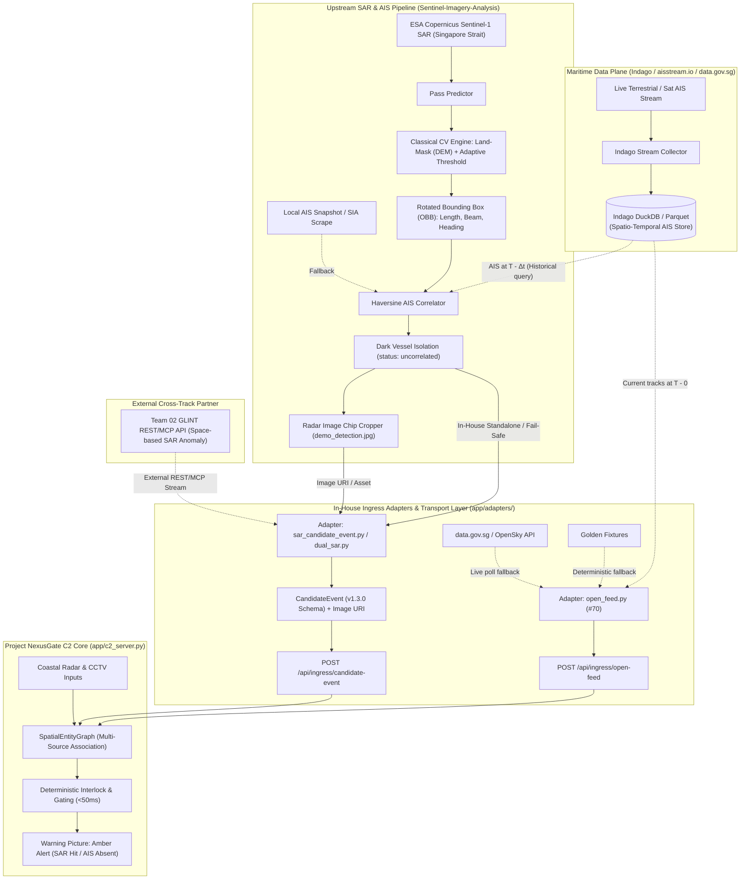
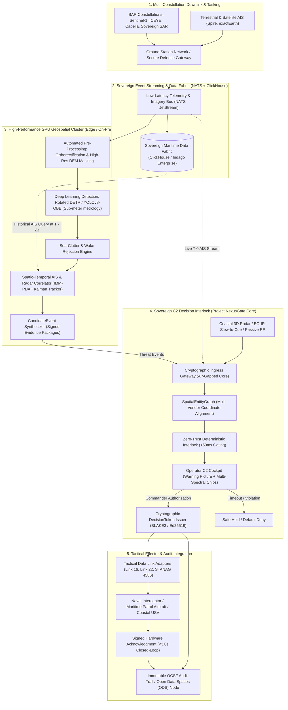

# Space-based SAR Pipeline & Production Architecture

SAR×AIS upstream and sovereign target architecture. Closed-loop / Screen placement live elsewhere: [Closed loop](index.md) · [Topology](topology.md). Doc roles: [architecture map](index.md#closed-loop).

This document specifies the integration of space-based Synthetic Aperture Radar (SAR) and maritime intelligence feeds into **Project NexusGate C2 Core**, spanning both **Immediate Hackathon Operations** and the **Target Production Sovereign Architecture**.

---

## 1. Executive Summary & Problem Context

In **SDTH 2026 PS 04 ("One Picture, Many Eyes")**, **Scenario S3** addresses coastal and shipping lane anomalies where maritime traffic operates outside standard cooperative reporting (AIS). 

Space-based SAR provides all-weather, day-and-night macro sea surveillance. However, operationalizing raw satellite radar imagery into actionable command tasking faces two major hurdles:
1. **The Ingestion & Metrology Gap**: Raw radar scenes are gigabytes in size and contain sea clutter, wave crests, and coastal noise. Converting pixels into discrete, physical kinematic records (length, beam, heading) without false alarms requires disciplined preprocessing.
2. **The Decision & Verification Gap**: Presenting radar blips to an operator without cross-correlating against cooperative AIS feeds creates visual confusion. Operators must see **why** a contact is anomalous (e.g., radar return present, AIS absent, coastal CCTV corroboration pending) before authorizing an interceptor or patrol USV.

To resolve this, the C2 architecture integrates an upstream **SAR × AIS Correlation Engine** ([`Sentinel-Imagery-Analysis`](https://github.com/StrixGoldhorn/Sentinel-Imagery-Analysis)) feeding structured, verified evidence packages into the NexusGate deterministic gating engine.

**Phase 2 (issue [#47](https://github.com/edgesentry/sdth-nexus-c2/issues/47)):** fixture-first ingress via `app/adapters/sentinel_imagery.py` + `POST /api/ingress/candidate-event` (`use_sentinel_fixture` / `pull_upstream` / `run_cv`). Sibling upstream at `http://127.0.0.1:5050` — not a git submodule. **GLINT Assumed-mock (issue [#55](https://github.com/edgesentry/sdth-nexus-c2/issues/55)):** `app/adapters/glint_client.py` + stub on `:5051` (`pull_glint` / `use_glint_fixture`). **Dual-SAR (issue [#56](https://github.com/edgesentry/sdth-nexus-c2/issues/56)):** `app/adapters/dual_sar.py` + ingress `dual_sar` / `pull_dual_sar`. Production multi-constellation / GPU CV remains Phase 5 (§3).

---

## 2. Immediate Hackathon Architecture (Venue-Ready & Zero-Risk)

For the 48-hour hackathon and live demonstration, the upstream pipeline operates either as a **local distributed microservice** or as a **hybrid cloud-hosted edge service**, so the demo path stays deterministic and runnable **with venue networking fully disconnected** (golden fixtures as the last fallback).

Downstream Screen 1 / HITL / Token / Screen 2 Ack / OCSF: [Closed loop](index.md) · [Topology](topology.md).

### 2.1 Upstream Data Mapping to NexusGate C2

The pipeline maps directly into the `sdth-nexus-c2` internal schema:

| Pipeline Field (`Sentinel-Imagery-Analysis`) | C2 Ingress Field (`CandidateEvent` v1.3.0) | Internal `Observation` Entity | Purpose |
|---|---|---|---|
| `detection_id` | `event_id` (e.g. `EVT-SAR-SG-001`) | `observation_id` | Tracking & audit trace |
| `latitude`, `longitude` | `location.latitude`, `location.longitude` | `latitude`, `longitude` | Spatial coordinate (WGS84) |
| `length` (m) | `attributes.vessel_length_m` | `attributes["length_m"]` | Physical vessel sizing |
| `beam` (m) | `attributes.vessel_beam_m` | `attributes["beam_m"]` | Aspect ratio verification |
| `angle` (deg) | `attributes.heading_deg` | `attributes["heading_deg"]` | Estimated vessel orientation |
| `confidence` (0.0–1.0) | `confidence` | `confidence` | Detection probability |
| `status == "uncorrelated"` | `event_type: "UNANNOUNCED_DARK_VESSEL"` | `attributes["ais_absent"] = True` | Amber Alert trigger |
| `cropped_chip_path` | `attributes.evidence_image_uri` | `attributes["evidence_image_uri"]` | Visual HITL verification |

### 2.2 Venue Deployment Options

To balance processing depth and live reliability, three deployment patterns are evaluated. Cloudflare Worker / container runbook: [Topology · Cloudflare](topology.md#cloudflare-phase-2) · [Deploy](../deploy.md).

| Deployment Pattern | Architecture | Strengths | Operational Role |
|---|---|---|---|
| **Pattern A: Hybrid Cloudflare (Recommended)** | Heavy CV pre-executed on real Sentinel-1 pass over Singapore Strait. Extracted `CandidateEvent` metadata and optimized radar chips (50–200 KB) hosted via Cloudflare (R2 / Containers). | Sub-100ms response time; cloud URL access; impervious to venue Wi-Fi congestion. | **Primary live demo path** |
| **Pattern B: Local Distributed (Zero-Internet)** | An upstream workstation runs `Sentinel-Imagery-Analysis` on port **5050**; C2 runs on port 8080. Local LAN or localhost REST (`pull_upstream` / `SAR_UPSTREAM_URL`). | Zero reliance on external internet; demonstrates real multi-machine networking. | **Hardened offline fallback** |
| **Pattern C: Full Cloudflare Container** | Entire Python / OpenCV / Flask stack containerized and deployed to Cloudflare Containers. | 100% unified cloud footprint, but requires bundling cached scenes to prevent large image download timeouts. | Optional technical stretch |

### 2.3 Dual-SAR Synergy & Temporal Kinematic Bridge

Beyond viewing raw radar chips, NexusGate resolves two fundamental operational hurdles:

1. **Dual-SAR Synergy (GLINT Macro Anomaly × SIA Micro Metrology)**:
   - **GLINT (Team 02)** detects macro statistical anomalies across wider shipping corridors (e.g. `UNANNOUNCED_DARK_VESSEL_CLUSTER` with confidence 0.88 over sector $B$).
   - **Sentinel-Imagery-Analysis (In-House)** extracts physical Oriented Bounding Box geometry (length 78.2m, beam 14.6m, angle -18.5°, confidence 0.91) and evidence radar chips (`demo_detection.jpg`).
   - **Unified Corroborator (`app/adapters/dual_sar.py`, issue [#56](https://github.com/edgesentry/sdth-nexus-c2/issues/56))**: When both observations align spatially within the sector (macro bbox or ≤3 km), the C2 synthesizes an enriched composite observation with elevated confidence ($\min(0.98, \max(c_g,c_s) + 0.1)$). Ingress: `POST /api/ingress/candidate-event` with `dual_sar=true` (fixtures) or `pull_dual_sar=true`. Venue resilience: if the live GLINT endpoint is down, `pull_dual_sar` falls back to the GLINT assumed fixture (and SIA live/fixture) and still returns `source=dual_sar` when the fixtures align spatially. `source=sia_only` applies when macro events cannot be loaded at all, or when SIA detections fall outside the macro corridor.

2. **Temporal Kinematic Projection (`core/kinematics.py`, issue [#57](https://github.com/edgesentry/sdth-nexus-c2/issues/57))**:
   - Satellite SAR overpasses are historical snapshots ($T - \Delta t$, typically 30 minutes to 4 hours old).
   - NexusGate projects the historical contact forward to current clock time $t_{\text{now}}$ using dead-reckoning kinematics:
     $$\mathbf{p}_{\text{proj}} = \mathbf{p}_{\text{sar}} + \Delta t \cdot \mathbf{v}_{\text{est}}$$
     $$R_{\text{uncertainty}}(\Delta t) = \Delta t \cdot \left(\frac{v_{\max} - v_{\min}}{2}\right) + \sigma_{\text{nav}}$$
   - When coastal radar detects an unannounced contact, NexusGate verifies if it falls within the reachability uncertainty ellipse $\mathbf{E}(\Delta t)$, mathematically establishing tracking continuity from space SAR to coastal tactical C2 without relying on cooperative AIS transponders. S3 wires this into `SpatialEntityGraph` association and the detector (`radar_in_envelope`).

### 2.4 Decoupled 3-Tier Architecture & Cognitive Load Compression

#### The Operational Dilemma
In high-density maritime corridors like the Singapore Strait, operators constantly face a critical ambiguity:
> **"Space SAR sees a vessel-like return. AIS indicates normal, compliant commercial traffic. Is this discrepancy radar sea clutter, a non-cooperative dark vessel, or satellite sensor latency?"**

NexusGate resolves this dilemma not by forcing raw pixels and millions of AIS points onto a single map, but by dividing the operational picture into **three decoupled tiers answering distinct questions at different time horizons**:

| Stage | Component | AIS Usage | Time Horizon | Question Answered |
|---|---|---|---|---|
| **Macro SAR** | **GLINT** (Team 02) | None required | Wide corridor scene | *"Is there an anomalous statistical cluster in this sector?"* |
| **Micro SAR × AIS** | **SIA** (In-house) | Matches against pass-time AIS snapshot to isolate unannounced returns | Satellite pass time ($T - \Delta t$) | *"Is this specific radar return a declared vessel or an unannounced dark contact?"* |
| **Tactical C2 Picture** | **NexusGate** $\leftarrow$ **Indago** | Overlays current background traffic via `app/adapters/open_feed.py` ([#70](https://github.com/edgesentry/sdth-nexus-c2/issues/70)) | Present clock time ($T \approx 0$) | *"How is traffic flowing right now, and what is the dynamic intercept vector?"* |

#### Cognitive Load Compression: Why This Matters for Defense Evaluators
1. **No Over-Fusion Hallucinations**:
   Rather than inventing a single "fused" synthetic track that might blend a legitimate tanker with an evasive threat, NexusGate preserves modality boundaries in `SpatialEntityGraph`.
2. **From Manual Cross-Referencing to Decision Authorization**:
   In legacy C4I workflows, operators manually query databases, overlay raster satellite images, and calculate time offsets. NexusGate pre-filters, correlates, and dead-reckons upstream.
   **The commander's cognitive burden shrinks from *"understand everything from raw data"* to *"authorize this sealed Amber Warning Picture & Tier-1 COA"*.**
3. **State Boundedness & Zero Database Coupling**:
   - C2 maintains zero internal database (no SQLite/RDB footprint).
   - AIS stream ingestion and spatio-temporal queries are delegated to **Indago (DuckDB/Parquet)**.
   - C2 ingests normalized `Observation` events only, guaranteeing sub-50ms deterministic gating.
4. **Zero-Risk Rehearsal Ladder**:
   `app/adapters/open_feed.py` queries local Indago DuckDB when active, falls back to live public APIs (`data.gov.sg`), and seamlessly defaults to deterministic golden fixtures (`tests/fixtures/open_ais_datagovsg.json`) if offline.

---

## 3. Target Production Sovereign Architecture

Beyond the 48-hour hackathon, operational defense and sovereign maritime domain awareness (e.g., DSTA, MINDEF/SAF, Singapore MPA, Japan Coast Guard) require an asynchronous, event-driven, air-gapped system capable of handling continuous multi-constellation satellite passes.

### 3.1 Production Architectural Components

#### 1. Constellation-Agnostic Ingestion & Automated Tasking
- **Multi-Constellation Support**: Ingestion adapters for ESA Sentinel-1 (C-band), ICEYE (X-band high-resolution), and Capella Space (sub-meter spotlight).
- **Automated Orbital Scheduling**: Ingress triggers calculated from Two-Line Element (TLE) satellite orbital mechanics, pre-cueing downstream processors prior to satellite overhead pass.

#### 2. GPU-Accelerated Rotated Object Detection (Deep Learning)
- **Rotated Bounding Box (OBB)**: Replaces classical Otsu/adaptive thresholding with deep rotated detectors (e.g., Rotated DETR, YOLOv8-OBB).
- **Physical Feature Extraction**: High-precision length, beam, and aspect angle calculation calibrated against radar incidence angles and slant-to-ground range projections.
- **Clutter & Wake Discrimination**: Distinguishes ship hull radar reflections from sea state chop, island fringes, and breaking wakes.

#### 3. Continuous Multi-Sensor Kinematic Association
- **Interacting Multiple Model (IMM-PDAF)**: Fuses discrete satellite SAR snapshots with continuous high-frequency coastal radar and optical camera feeds without relying on shared vessel IDs.
- **Anti-Spoofing Corroboration**: Identifies MMSI cloning, GPS offset spoofing, and deliberate transponder shutdowns.

#### 4. Deterministic Sovereign Gating (NexusGate Core)
- **Air-Gapped Deployment**: Zero external API dependencies; deployed directly within sovereign defense enclaves.
- **Strict Latency Bounds**: Fast-rejection of invalid proposals in `<5ms`; full interlock evaluation in `<50ms`.
- **Cryptographic Tasking Tokens**: Orders issued with tamper-evident BLAKE3 / Ed25519 digital signatures ensuring non-repudiation. **(Target state. `core/audit.py` is SHA-256 today; BLAKE3 + Ed25519 arrive by consuming `edgesentry-rs` — do not claim BLAKE3 until that is wired.)**

#### 5. Interoperable Tactical Effector Integration
- **Tactical Data Adapters**: Compliant with military protocol baselines (MIL-STD / Link 16 / Link 22) and autonomous vehicle standards (STANAG 4586).
- **OCSF & ODS Audit Compliance**: Full operational telemetry and gating decisions recorded to an immutable hash chain, compliant with Open Cybersecurity Schema Framework (OCSF) and sovereign Open Data Spaces (ODS) audit mandates.

---

## 4. Verification & Testing Strategy

Executable curl / Path checklists live outside this page (avoid duplicating SoT):

* Ingress contract & CandidateEvent flags: [REST · Upstream Ingress](../api/rest.md#upstream-ingress-contract-assumed-candidateevent-specification)
* E2E modes (fixture / pull / dual-SAR) and Path ARCHVIEW: [E2E verification](../verify-e2e.md)
* AIS correlate then C2 (live scan): [Demo · Sentinel](../demo.md#ais-correlate-then-c2-live-scan)
* Closed-loop latency: `./scripts/picture_to_tasking.sh` · Scenario S3: `uv run python -m app.main --scenario S3 --stub --yes`
