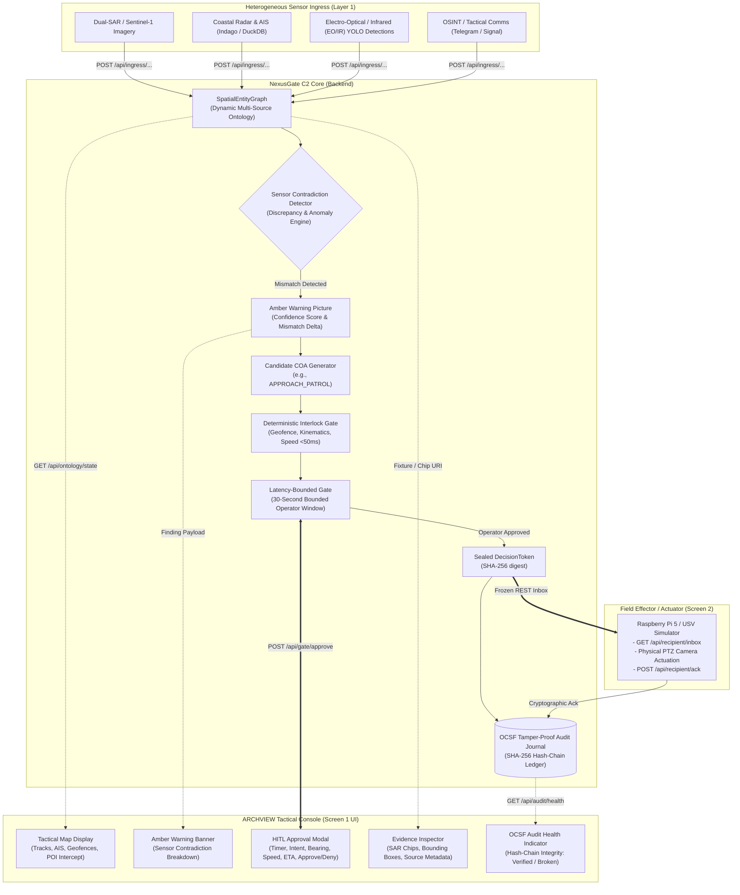
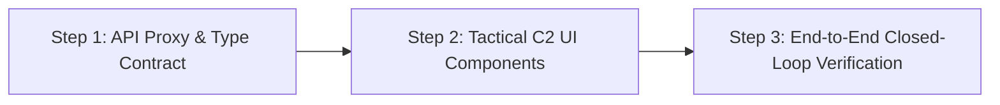

# Architecture Proposal: ARCHVIEW Tactical Console & NexusGate C2 Core Integration

> **SDTH 2026 PS 04 — One Picture, Many Eyes (From Picture to Tasking)**  
> **Topic:** Integration Strategy between the Tactical Operator UI ([ARCHVIEW](https://github.com/johnnyteoh8888/SDTH-2026)) and the Deterministic C2 Governance Engine ([MOSAIC NexusGate](https://github.com/edgesentry/sdth-nexus-c2)).

---

## 1. Executive Summary

This proposal evaluates whether to combine the codebases into a single monolithic application or to establish a decoupled, contract-driven architecture where:
1. **The Tactical Console** ([ARCHVIEW](https://github.com/johnnyteoh8888/SDTH-2026)) specializes in the **Screen 1 Command Cockpit & Tactical Operator Experience (UI/UX)** grounded in defense operational doctrine.
2. **The C2 Core Engine** ([MOSAIC NexusGate](https://github.com/edgesentry/sdth-nexus-c2)) specializes in **Multi-Sensor Ingress, Dynamic Ontology, Contradiction Detection, Deterministic Gating, OCSF Tamper-Proof Auditing, and Effector Tasking**.

### Recommendation: Decoupled Integration

**We recommend a decoupled integration model.** Rather than rewriting or folding all logic into a single repository, the project achieves maximum velocity and domain credibility by establishing a clear separation of concerns:

* **Tactical Console (Front-End Lead / Defense Operations):** Focuses exclusively on the operator cockpit, military-grade map symbology, situational awareness presentation, and Rules of Engagement (ROE) workflow.
* **C2 Core Engine (AI Platform / Systems Lead):** Serves as the sovereign, high-throughput verification backend executing sensor graph management, probabilistic contradiction detection, deterministic safety interlocks (<50 ms), cryptographic token sealing (**SHA-256** DecisionToken / OCSF hash chain for this epic; Ed25519 is out of scope), and field actuator communication.

---

## 2. Strategic Rationale

### 2.1 Leveraging Defense Operational Domain Expertise
The project's Defense Operations Lead brings active-duty military and defense technology expertise (MINDEF / SAF operational background, tactical communications, and C2 workflows). 

Having this lead focus on the **Command Console UI/UX and Operational Realism** delivers the highest strategic advantage:
* Evaluators from defense and homeland security agencies (DSTA, SAF C4I, HTX, SMCC/MSTF) judge C2 systems based on operational fidelity, clear priority escalations, and adherence to military doctrine.
* Offloading low-level cryptographic hashing, kinematic physics validation, and asynchronous queuing to the backend frees the defense expert to focus on tactical symbology (MIL-STD/APP-6), situational clarity, and authentic maritime conflict workflows (e.g., Singapore Strait TSS / Dark Vessel interdiction).

### 2.2 Perfect Complementarity of Scopes

The stated design boundaries of both repositories demonstrate zero overlap and complete alignment:

| Capability Layer | Tactical Console ([ARCHVIEW](https://github.com/johnnyteoh8888/SDTH-2026)) | C2 Core Engine ([NexusGate](https://github.com/edgesentry/sdth-nexus-c2)) |
| :--- | :--- | :--- |
| **Primary Scope** | Evidence review, dark-themed BattlePlan map interface, manual review tracking. | Deterministic C2 governance bridging the Picture-to-Tasking handoff gap. |
| **Documented Boundaries** | Explicitly excludes: military tasking, effector control, tactical fusion, strike impact, tamper-proof logging, guaranteed latency. | Directly implements: candidate COA generation, sub-50ms deterministic interlocks, sealed `DecisionToken`, OCSF audit chain, effector Ack loops. |
| **Tech Stack** | Modern React, TypeScript, Leaflet, Lucide icons, Vite (`127.0.0.1:3001`). | High-performance Python, FastAPI, Pydantic, SHA-256 OCSF chain, DuckDB. |
| **Role in Pitch** | **Screen 1: Command Cockpit** (Visual centerpiece for VIP evaluators). | **C2 Governance Backbone** (The non-bypassable policy and audit spine). |

---

## 3. System Architecture & Information Flow

---

## 4. API Integration Surface

The Tactical Console integrates with the C2 Core via clean, stateless REST interfaces. Contract authority: [`docs/api/rest.md`](api/rest.md) and [`docs/api/archview-types.ts`](api/archview-types.ts). Core default base: **`http://127.0.0.1:8080`**.

### 4.1 Situational Picture & Ontology Stream
* **Endpoint:** `GET /api/ontology/state`
* **Consumer:** Tactical Console Map Layer.
* **Payload:** Active tracks (kinematics, coordinates, latest point), raw observations, sensor modalities, and evidence URLs. Ontology amber object uses field **`alert`** for the contradiction class.
* **Behavior:** Renders friendly units (Blue force), suspected targets (Amber/Red force), and sensor coverage cones on the Leaflet map.

### 4.2 Amber Warning Picture & Proposals
* **Endpoint:** `POST /api/gate/proposals` (or `POST /api/interpret`)
* **Consumer:** Tactical Console Alert Bar and COA Proposal Card.
* **Payload:** Discrepancy details (e.g., *Stationary AIS vs 20 kt Radar*, *Dual-SAR Vessel Anomaly*), confidence score, mismatch distance, and candidate Courses of Action (COAs). Finding payloads use string key **`amber_alert`** for the contradiction class (distinct from the ontology amber object).
* **Behavior:** Displays an Amber Alert banner demanding operator attention without collapsing disagreeing sensors into a speculative fused track.

### 4.3 Human-in-the-Loop (HITL) Gate Approval
* **Endpoint:** `POST /api/gate/approve`
* **Consumer:** Tactical Console Action Toolbar / Modal.
* **Payload:** `{"coa_id": "<uuid>", "decision": "y" | "n", "operator_id": "<human_operator>"}`. Effector **`unit_id`** is set when queuing proposals / reading inbox — not on approve.
* **Behavior:** Operator confirms the engagement within the bounded time window (e.g., 30s countdown). Sealing occurs exclusively within NexusGate Core.

### 4.4 Cryptographic Audit Trail
* **Endpoints:** `GET /api/audit/health` (pill), `GET /api/audit/trail` (full records)
* **Consumer:** Tactical Console Security & Compliance Widget.
* **Payload:** Health returns `{ verified, broken, count, label }` over the SHA-256 OCSF hash chain. Trail returns full linked records when the operator drills in.
* **Behavior:** Provides real-time proof to evaluators that all taskings and operator decisions are tamper-evident and non-repudiable.

---

## 5. Team Synergy & Work Breakdown

| Functional Area | Assigned Lead | Core Deliverables |
| :--- | :--- | :--- |
| **Tactical Console & Operator UX** | **Defense Operations & Comms Lead** | • ARCHVIEW React front-end refinement. • Tactical symbology (MIL-STD/APP-6 style). • Operational scenario design and ROE validation. • HITL countdown and approval UX. |
| **C2 Engine & Platform Core** | **AI Platform Architect** | • FastAPI backend optimization and CORS configuration. • `SpatialEntityGraph` and contradiction heuristics. • Deterministic safety interlocks (<50 ms) & SHA-256 token sealing. • OCSF tamper-evident audit chain (`GET /api/audit/health`). • Effector inbox/ack distribution API. |
| **Geospatial & Sensor Fusion** | **Geospatial Analytics Lead** | • Singapore Strait traffic separation scheme (TSS) corridors. • Coordinate frame harmonization (WGS84, SVY21). • Sensor FOV geometry and clock-drift correction. |
| **AI Inference & Object Detection** | **AI / Object Detection Lead** | • Dark vessel / UAV YOLO detection pipeline. • Confidence scoring and Observation normalization. |
| **Embedded Edge & Physical Effector** | **Embedded Hardware Lead** | • Screen 2: Raspberry Pi 5 node and physical actuator. • Effector polling (`/api/recipient/inbox`) and execution Ack. |

---

## 6. Execution Roadmap

### Step 1: API Proxy & Type Contract
* Configure the Tactical Console Vite development server (`127.0.0.1:3001`) to reach C2 Core FastAPI (**port 8080**). ARCHVIEW already proxies `/api` → its evidence BFF (`:3102`); use path splits or a `/c2` prefix so Core routes do not collide (#95).
* Consume NexusGate [`docs/api/archview-types.ts`](api/archview-types.ts) for `Finding` / ontology / approve / audit health types (`operator_id`, `alert` vs `amber_alert`).

### Step 2: Tactical C2 UI Components
* Implement the **Amber Warning Banner** in the console when a sensor discrepancy is detected.
* Implement the **HITL Decision Card** featuring a visual countdown timer, lead intercept coordinates (Lat, Lon, Bearing, Speed, ETA), and Approve/Deny actions.
* Connect the **Evidence Inspector** to preview dual-SAR imagery chips and optical bounding boxes served from the backend.
* Wire the **Audit health pill** to `GET /api/audit/health`.

### Step 3: End-to-End Closed-Loop Verification
* Run Hero Scenario S3 (Singapore Strait Shipping Lane Anomaly):
  1. Ingress dual-SAR and coastal radar feeds via backend.
  2. Tactical Console displays conflicting tracks and triggers Amber Warning.
  3. Operator reviews evidence chips and clicks **Approve** on the console.
  4. C2 Core seals `DecisionToken` and logs to the OCSF hash chain.
  5. Screen 2 (Raspberry Pi 5 effector) consumes tasking, triggers physical actuation, and posts cryptographic Ack.
  6. Tactical Console reflects tasking execution completion with verified audit status.
