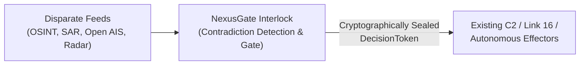
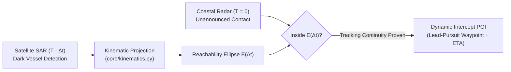

# Defense FAQ & Pitch Q&A

This document provides definitive answers to operational, architectural, and procurement questions anticipated from senior defense evaluators (**MINDEF Leadership, RSAF Chief of Air Force, Chief Defence Scientist, and DSTA C4I Directors**) during SDTH 2026.

---

## 1. Strategic & Operational Positioning

### Q1.1: Does NexusGate replace existing military C2 systems (e.g. Link 16, Command Centers, US/NATO C4I)?
**No. NexusGate does not replace sovereign C2 systems.**  
NexusGate operates as a **deterministic safety interlock and governance gateway** positioned upstream of tactical effectors and adjacent to existing C4I networks:

* **The Problem It Solves**: Legacy C2 systems assume unified tracks or rely on slow, manual voice/radio deconfliction when sensors disagree.
* **NexusGate's Role**: It acts as the mathematical guardrail ensuring that uncorroborated, hallucinatory, or spoofed data never triggers unwarranted kinetic action.

---

### Q1.2: Why separate Probabilistic Interpretation from Deterministic Gating?
**Because AI and multi-sensor fusion algorithms can hallucinate, be spoofed, or suffer from sensor noise—but military kinetic action must never hallucinate.**

* **Probabilistic Layer (`app/`)**: Generates hypotheses, parses noisy social chatter, and proposes candidate Courses of Action (COAs).
* **Deterministic Layer (`core/`)**: Enforces hard physics (<50ms geofence checks, velocity clamps, duplicate rejection), verifies human authority (HITL), seals cryptographic tokens, and logs immutable OCSF audit chains.
* **Golden Rule**: *Probabilistic proposes; deterministic disposes.*

---

## 2. Sensors, Noise & OSINT Governance

### Q2.1: Why include civilian social media / OSINT in military C2? Isn't it full of rumors and enemy disinformation?
**We include OSINT precisely *because* it is noisy and prone to exaggeration.**

1. **Human as a Distributed Sensor**: Low-flying attritable drones (e.g. Shahed-136) often slip beneath radar horizons or coastal terrain clutter. Civilian social media reports often provide the *first operational cue* minutes before radar acquisition.
2. **Preventing Kinetic Over-Reaction**: In Scenario 2 (S2), social chatter reports *"20 swarm drones incoming"*, while radar sees only 1 contact. An ungoverned C2 risks launching expensive surface-to-air missiles prematurely.
3. **The Amber Discrepancy Gate**: NexusGate surfaces the **Amber contradiction** (*Count & Bearing Mismatch*) and routes the decision to non-kinetic **`CUE_AND_IDENTIFY`** (slewing EO/IR cameras and recon drones) rather than authorizing lethal overkill.

---

### Q2.2: Does NexusGate crawl social media directly?
**No. C2 Core never crawls, scrapes, or directly connects to public social media.**

* **Air-Gap & Enclave Security**: Military C2 runs inside restricted or air-gapped networks (e.g. SIPRNet, tactical edge servers) that forbid outbound internet scraping.
* **Decoupled Architecture**: Crawling, multi-modal NLP, video OCR, and bot-mitigation pipelines run in an **External Threat Intelligence Platform**.
* **Ingress Contract**: External platforms distill chatter into structured claims (`timestamp`, `lat/lon`, `claimed_count`, `confidence`), which NexusGate ingests via [`app/adapters/osint_text.py`](data-provenance.md#inventory).

---

## 3. Space SAR & Kinematic Projection

### Q3.1: Satellite SAR images are hours old ($T - \Delta t$). How can historical radar task real-time tactical effectors ($T = 0$)?
**Through Temporal Kinematic Dead-Reckoning and Dynamic Lead-Pursuit Interception.**

1. **Reachability Ellipse**: NexusGate projects the dark vessel forward using maximum/minimum velocity bounds to calculate an uncertainty envelope $\mathbf{E}(\Delta t)$.
2. **Correlation Without MMSI**: When coastal radar detects an unannounced contact inside $\mathbf{E}(\Delta t)$, tracking continuity is mathematically established without relying on cooperative AIS.
3. **Dynamic Intercept POI**: Rather than dispatching patrol craft to the historical contact location (which is now empty water), NexusGate computes the optimal forward intercept point based on relative interceptor velocity.

---

## 4. Security, Zero-Trust & Accountability

### Q4.1: How do you prevent an insider or rogue operator from falsifying an approved strike?
**Through an append-only, cryptographic OCSF hash chain.**

* Every state transition (proposal, fast-reject, operator approval, recipient inbox delivery, field ack) is hashed into an immutable chain (`prev_hash → hash`).
* If an insider tampers with even a single character in `.audit/gate.jsonl` (e.g. changing `REJECTED` to `APPROVED`), the chain breaks immediately:
  $$\text{hash}_i \neq \text{SHA-256}(\text{record}_i)$$
* The system halts execution, flags a security violation, and preserves forensic integrity.

---

### Q4.2: What happens during electronic warfare (EW), jamming, or network severance (DIL)?
**NexusGate falls back gracefully through an automatic Degraded Mode Ladder:**

| State | Environmental Condition | System Behavior |
|---|---|---|
| **Tier 1: Nominal** | High-bandwidth, cloud available | Live REST API, Cloudflare Containers, real-time streaming |
| **Tier 2: Disconnected** | Cloud severed, external APIs down | Automatic fallback to local DuckDB parquet cache / in-house SIA (:5050) |
| **Tier 3: Degraded DIL** | Extreme jamming, zero external comms | Hardened local Golden Fixtures; zero-network execution on local laptop/RasPi |

The deterministic gate runs entirely in-memory with zero cloud dependencies, guaranteeing **sub-50ms rule evaluation** even under total network severance.

---

## 5. Defense Procurement & Deployment Roadmap

### Q5.1: What are the Slide 11 quantitative performance commitments?
NexusGate's automated benchmark suite (`scripts/benchmark.py`) verifies 4 core metrics on every build:

1. **Gate Latency (p95)**: `< 50 ms` (measured at ~0.02 ms in test runs).
2. **Unauthorized Taskings**: `0` (100% fast-reject on geofence, velocity, duplicate, and timeout violations).
3. **Picture-to-Ack Roundtrip**: `< 3.0 s` (operator approval $\to$ recipient inbox $\to$ signed field Ack).
4. **Audit Trace Integrity**: `100% OCSF compliance` (complete hash-chain continuity).

---

### Q5.2: What is the post-hackathon transition path to MINDEF / DSTA (Phase 5)?
Phase 5 aligns with the **9-month NUS Defence Tech Venture Lab (DT-VL)** incubation bridge:

1. **Sandbox Integration (Months 1–3)**: Deploy NexusGate as an evaluation add-on gateway within DSTA/SAF simulation testbeds.
2. **Controlled Field Trials (Months 4–6)**: Conduct maritime trials in Singapore waters with autonomous USV partners (e.g. Clearbot) validating real physical recipient Ack.
3. **Protocol Bridges (Months 7–9)**: Implement tactical edge adapters for Link 16, Link 22, and STANAG 4586 compliant payloads.
