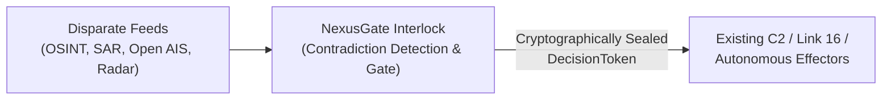
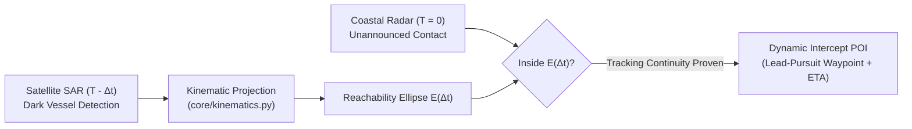

# Defense FAQ & Pitch Q&A

This document provides definitive answers to operational, architectural, and procurement questions anticipated from senior defense evaluators (**MINDEF Leadership, RSAF Chief of Air Force, Chief Defence Scientist, and DSTA C4I Directors**) during SDTH 2026.

**MOSAIC C2** is the Challenge 04 application identity; **NexusGate** is the deterministic verification engine (`core/`) that seals tasking. Pitch scope is **100% maritime** under Singapore WOG coordination (SMCC / MSTF, SPF PCG → RSN, MPA VTIS/STRAITREP).

---

## 1. Strategic & Operational Positioning

### Q1.1: Does NexusGate replace existing military C2 systems (e.g. Link 16, Command Centers, US/NATO C4I)?
**No. NexusGate does not replace sovereign C2 systems.**  
NexusGate (inside MOSAIC C2) operates as a **deterministic safety interlock and governance gateway** positioned upstream of tactical effectors and adjacent to existing C4I networks:

* **The Problem It Solves**: Legacy C2 systems assume unified tracks or rely on slow, manual voice/radio deconfliction when sensors disagree.
* **NexusGate's Role**: It acts as the mathematical guardrail ensuring that uncorroborated, hallucinatory, or spoofed data never triggers unwarranted kinetic action.

---

### Q1.2: Why separate Probabilistic Interpretation from Deterministic Gating?
**Because AI and multi-sensor fusion algorithms can hallucinate, be spoofed, or suffer from sensor noise—but military kinetic action must never hallucinate.**

* **Probabilistic Layer (`app/`)**: Generates hypotheses, parses noisy social chatter, and proposes candidate Courses of Action (COAs).
* **Deterministic Layer (`core/`)**: Enforces hard physics (<50ms geofence checks, velocity clamps, duplicate rejection), verifies human authority (HITL), seals cryptographic tokens, and logs immutable OCSF audit chains.
* **Golden Rule**: *Probabilistic proposes; deterministic disposes.*

---

## 2. Sensors, Noise & OSINT Governance

### Q2.1: Why include civilian social media / OSINT in military C2? Isn't it full of rumors and enemy disinformation?
**We include OSINT precisely *because* it is noisy and prone to exaggeration.**

1. **Human as a Distributed Sensor**: small craft running dark, ship-to-ship (STS) transfers at anchor, and AIS gaps in cluttered littoral water are frequently reported by fishermen, port workers, and ferry passengers **before** a track is firmly held. The eyewitness is an uncalibrated sensor, not a useless one.
2. **Preventing Over-Reaction**: unverified chatter inflates counts and positions. An ungoverned C2 risks committing scarce patrol assets — or an intrusive boarding — on a single unconfirmed report.
3. **The Amber Discrepancy Gate**: NexusGate surfaces the **Amber contradiction** (*Count & Bearing Mismatch*) and routes the decision to non-kinetic **`CUE_AND_IDENTIFY`** (slewing EO/IR, re-tasking a patrol craft) instead of an irreversible action.

> ⛔ **Do not use the air / drone example in the pitch.** The [2026-09-20 team decision](https://github.com/edgesentry/edgesentry-commercial/blob/main/docs/strategy/sdth2026/meeting-20260920-sdth-planning.md) locked scope to **100% maritime**. Scenario S2 (Shahed-136 corridor) remains in the repo because the discrepancy mechanism is domain-agnostic and reused by the maritime scenarios, but it is no longer the hero and must not be presented.

---

### Q2.2: Does NexusGate crawl social media directly?
**No. C2 Core never crawls, scrapes, or directly connects to public social media.**

* **Air-Gap & Enclave Security**: Military C2 runs inside restricted or air-gapped networks (e.g. SIPRNet, tactical edge servers) that forbid outbound internet scraping.
* **Decoupled Architecture**: Crawling, multi-modal NLP, video OCR, and bot-mitigation pipelines run in an **External Threat Intelligence Platform**.
* **Ingress Contract**: External platforms distill chatter into structured claims (`timestamp`, `lat/lon`, `claimed_count`, `confidence`), which NexusGate ingests via [`app/adapters/osint_text.py`](data-provenance.md#inventory).

---

## 3. Space SAR & Kinematic Projection

### Q3.1: Satellite SAR images are hours old ($T - \Delta t$). How can historical radar task real-time tactical effectors ($T = 0$)?
**Through Temporal Kinematic Dead-Reckoning and Dynamic Lead-Pursuit Interception.**

1. **Reachability Ellipse**: NexusGate projects the dark vessel forward using maximum/minimum velocity bounds to calculate an uncertainty envelope $\mathbf{E}(\Delta t)$.
2. **Correlation Without MMSI**: When coastal radar detects an unannounced contact inside $\mathbf{E}(\Delta t)$, tracking continuity is mathematically established without relying on cooperative AIS.
3. **Dynamic Intercept POI**: Rather than dispatching patrol craft to the historical contact location (which is now empty water), NexusGate computes the optimal forward intercept point based on relative interceptor velocity.

---

## 4. Security, Zero-Trust & Accountability

### Q4.1: How do you prevent an insider or rogue operator from falsifying an approved strike?
**Through an append-only, cryptographic OCSF hash chain.**

* Every state transition (proposal, fast-reject, operator approval, recipient inbox delivery, field ack) is hashed into an immutable chain (`prev_hash → hash`).
* If an insider tampers with even a single character in `.audit/gate.jsonl` (e.g. changing `REJECTED` to `APPROVED`), the chain breaks immediately:
  $$\text{hash}_i \neq \text{SHA-256}(\text{record}_i)$$
* The system halts execution, flags a security violation, and preserves forensic integrity.

---

### Q4.2: What happens during electronic warfare (EW), jamming, or network severance (DIL)?
**NexusGate falls back gracefully through an automatic Degraded Mode Ladder:**

| State | Environmental Condition | System Behavior |
|---|---|---|
| **Tier 1: Nominal** | High-bandwidth, cloud available | Live REST API, Cloudflare Containers, real-time streaming |
| **Tier 2: Disconnected** | Cloud severed, external APIs down | Automatic fallback to local DuckDB parquet cache / in-house SIA (:5050) |
| **Tier 3: Degraded DIL** | Extreme jamming, zero external comms | Hardened local Golden Fixtures; zero-network execution on a **single laptop** (RasPi excluded from the demo path — 2026-09-17) |

The deterministic gate runs entirely in-memory with no cloud dependency, so rule evaluation stays **sub-50 ms even with the network severed**. Stated precisely: what we demonstrated is that **on a single node, the path from gate to an independent effector process completes with external networking disconnected**. We have not demonstrated an edge device, and edge deployment is a design claim only.

---

## 5. Defense Procurement & Deployment Roadmap

### Q5.1: What are the quantitative performance commitments?

**Revised 2026-09-21.** We previously committed to `0 unauthorized` and `100% audit integrity`. **Both are withdrawn** — unfalsifiable absolutes invite precisely the audit a defence evaluator will run. The primary metric also moved: gate latency was never the bottleneck. See [PLAN §5](plan.md#5-quantitative-operational-benchmarks-slide-11-proof).

| # | Metric | What we report | What it cannot show |
|---|---|---|---|
| **1 ★** | **Total decision time** (t0 = `CandidateEvent` ingress → t1 = approval committed), **A/B against a manual swivel-chair baseline** | Measured median and spread. **No pre-committed number.** | n≈4 operators, synthetic scenarios, operators who built the system. Not a claim about trained watchkeepers under stress. |
| 2 | Effector Ack roundtrip | `< 3.0 s`, with the recipient as a **separate OS process** | Laptop-local. No radio link, no contested spectrum. |
| 3 | Gate transit latency (p95) | `< 50 ms` (~0.02 ms observed) — **secondary** | Table stakes, not a differentiator. |
| 4 | Deterministic refusal coverage | `n/n` cases passed (geofence, velocity, duplicate, timeout) | Near-tautological: the gate refuses what it was written to refuse. **Does not cover multi-sensor collusion, or a plausible COA that breaks no rule.** |
| 5 | Audit chain verifiability | Broken-link count (expect `0 of n` records), recomputed by `eds audit verify-chain` in a **separate binary** | Detects tampering; **does not prevent it**. An attacker with write access can truncate the tail. |
| 6 | Tracking continuity (UNCLOS Art. 111) | Unexplained gaps across asset handoffs | Continuity of **our own records**, not a legal finding. |

**Do not say** "BLAKE3" until `edgesentry-rs` is wired (`core/audit.py` is SHA-256 today), or "it ran on real hardware" (laptop only).

---

### Q5.2: What is the post-hackathon transition path to MINDEF / DSTA (Phase 5)?
Phase 5 aligns with the **9-month NUS Defence Tech Venture Lab (DT-VL)** incubation bridge:

1. **Sandbox Integration (Months 1–3)**: Deploy NexusGate as an evaluation add-on gateway within DSTA/SAF simulation testbeds.
2. **Controlled Field Trials (Months 4–6)**: Conduct maritime trials in Singapore waters with autonomous USV partners (e.g. Clearbot) validating real physical recipient Ack.
3. **Protocol Bridges (Months 7–9)**: Implement tactical edge adapters for Link 16, Link 22, and STANAG 4586 compliant payloads.
