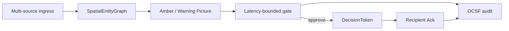

# sdth-nexus-c2

SDTH 2026 **PS 04 — One Picture, Many Eyes**: disagreeing sensors → **Warning Picture** → latency-bounded HITL → effector Ack.

> We don’t just fuse the picture. We govern the action with deterministic certainty.



| Scenario | One-line |
|----------|----------|
| **S1** | Clearance — spoofed AIS vs radar / EO blur |
| **S2** | Shadow Intruder — social OSINT count vs radar (cue & identify) |
| **S3** | Dark Vessel — space SAR cluster vs AIS silence |

| Path | Role |
|------|------|
| **`core/`** | NexusGate — spatial graph, deterministic interlocks, latency-bounded gate, OCSF audit |
| **`app/`** | Venue C2 — S1–S3 scenarios, REST server, Warning Picture TUI, adapters, `/verify` harness |
| **`mocks/`** | HTTP stubs (USV effector `:8000`, GLINT Assumed-mock `:5051`) |
| **`deploy/`** | LiteLLM proxy + Cloudflare Containers Worker |
| **`scripts/`** | CLI entry points (Picture→Tasking, streamer, benchmarks, mock launchers) |

## Docs map

- **[Architecture](architecture/index.md)** — Picture→Tasking closed loop
- **[Topology](architecture/topology.md)** — laptop I/O + local / Cloudflare Core
- **[Space SAR Pipeline](architecture/sar_pipeline.md)** — Sentinel-1 / Sentinel-Imagery-Analysis (SIA) ingress & fixture fail-safe
- **[C2 REST API](api/rest.md)** — Screen 1 / Screen 2 **frozen** contract (curl / TUI / verification WebUI)
- **[Data provenance](data-provenance.md)** — Synthetic vs Real-processed vs Assumed-mock
- **[Cloudflare Containers](deploy.md)** — Worker + container Core, `C2_BASE_URL`, local fallback
- **[LiteLLM](litellm.md)** — probabilistic interpret + proxy keys
- **[Scenarios](scenarios.md)** — S1–S3 + optional open feeds
- **[Demo & benchmarks](demo.md)** — two-laptop I/O (#17), verification WebUI (Path F), streamer, Picture→Tasking, gate/latency benchmarks (pitch Slide 11), tests
- **[E2E verification](verify-e2e.md)** — `/verify` Path F; SIA/GLINT optional (fixtures default)
- **[Roadmap](roadmap.md)** — Phase 0–5
- **[Plan](plan.md)** — full planning source

## Quick start

CLI demo (no long-running server):

```bash
uv sync
./scripts/demo.sh                 # default SCENARIO=S1
SCENARIO=S2 ./scripts/demo.sh
uv run python -m app.main --scenario S3 --stub --yes
```

REST Core + verification WebUI (one process):

```bash
uv run sdth-c2-server             # http://127.0.0.1:8080
# open http://127.0.0.1:8080/verify  (Screen 1/2 — not the external pitch UI)
```

Optional live LLM: [litellm.md](litellm.md) + [demo.md](demo.md) Path D.

## Tests

```bash
uv run pytest tests/unit/ -q
uv run pytest tests/integration/ -v -m integration
uv run python scripts/benchmark.py   # gate / ack / audit proof (pitch Slide 11)
```

## Limits

- Probabilistic proposes; **deterministic gate** alone seals tokens
- Scenario detectors remain deterministic rules (LLM is optional overlay)
- **UI Boundary:** `/verify` (Jinja2/HTMX on Core) and console TUI are **verification harnesses only**. **BattlePlan** (external pitch UI) lives **outside this repository**. In-repo WebUI is demo-grade (no full map / GIS); dual-key Tier 2 not implemented
- Kinetic intercept is **not** claimed (S2 cues identify only)
- C2 has **no application DB** — runtime is in-memory; audit is jsonl; AIS persistence is decoupled to Indago (DuckDB) and [Sentinel-Imagery-Analysis](architecture/sar_pipeline.md) (SIA) SQLite; C2 consumes current tracks via adapters

Site: [edgesentry.github.io/sdth-nexus-c2](https://edgesentry.github.io/sdth-nexus-c2/) · Repo: [edgesentry/sdth-nexus-c2](https://github.com/edgesentry/sdth-nexus-c2)
