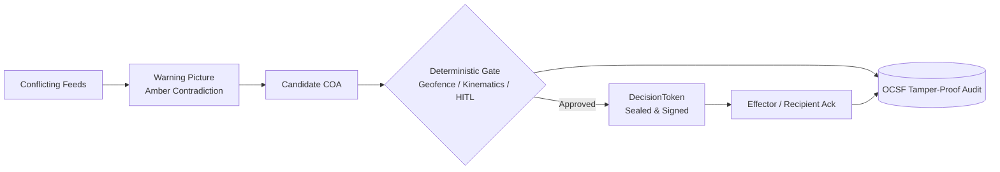

# Executive Brief: sdth-nexus-c2

> **"We don’t just fuse the picture. We govern the action with deterministic certainty."**

**sdth-nexus-c2** is a deterministic Command-and-Control (C2) governance engine built for SDTH 2026 Problem Statement 04 (*One Picture, Many Eyes*). It bridges the critical operational gap between multi-sensor contradiction detection and verifiable tactical effector tasking.

---

## 1. Problem Statement: The Picture-to-Tasking Gap

Operational commanders and C4 evaluators (**DSTA / MINDEF·SAF C4I / MDA**) have access to multiple sensor feeds (Radar, AIS, Space SAR, EO/IR, Social OSINT). However, existing systems break down when translating conflicting pictures into actionable field tasking:

1. **Sensor Contradictions Without Shared IDs:** Feeds disagree on timestamps, positions, and counts.
2. **The Over-Fusion Trap:** Forcing conflicting signals into one "fused" picture causes AI/heuristic hallucinations (e.g., phantom drone swarms or blended tracks).
3. **The Under-Processing Trap:** Avoiding automated fusion forces operators into slow, informal verbal tasking lacking cryptographically sealed authority or audit trails.

---

## 2. Our Solution: Two-Layer Architecture

NexusGate decouples **probabilistic situational awareness** from **deterministic action governance**:



* **Layer 1: Probabilistic Warning Picture (`app/`)**  
  Ingests raw, contradictory data into a `SpatialEntityGraph`. Instead of guessing a single fused track, it surfaces an **Amber Finding** (e.g., *Count & Bearing Mismatch*) and recommends a candidate Course of Action (COA).
* **Layer 2: Deterministic Action Gate (`core/`)**  
  Enforces hard rules (<50ms fast-reject on geofence, velocity, and duplicates). Enforces a latency-bounded Human-in-the-Loop (HITL) approval window. Upon approval, seals a cryptographic `DecisionToken` and tracks effector execution through a closed-loop `Recipient Ack`, logged to an immutable Open Cybersecurity Schema Framework (OCSF) audit trail.

---

## 3. Operational Scenarios

| ID | Operational Focus | Sensor Contradiction | Deterministic Action |
|----|-------------------|----------------------|----------------------|
| **S1** | **Sea Approach** | Spoofed AIS stationary vs. ~20 kt radar/EO blur (~850m offset) | `ISR_IDENTIFY_CONTACT` dispatched to verify track |
| **S2** | **Air Corridor** *(Hero)* | Social media claims "3 drones" vs. radar "1 target" + bearing disagreement | Non-kinetic `CUE_AND_IDENTIFY` (prevents kinetic over-reaction) |
| **S3** | **Shipping Lane** | Space SAR cluster (Sentinel-1) vs. AIS radio silence + coastal radar | `APPROACH_PATROL` via dead-reckoning kinematics |

---

## 4. Key Verified Metrics

* **Gate Latency:** `<50ms` deterministic rule evaluation & token sealing.
* **Closed-Loop Verification:** Complete audit record from Commander approval (`approve`) to field effector execution (`ack`).
* **Audit Compliance:** 100% OCSF JSONL event stream capturing every state transition and operator ID.
* **Architectural Safety:** Probabilistic layers (including LLMs) are strictly restricted to proposing; **only deterministic code seals action tokens**.

---

## 5. Live Demonstration in 60 Seconds

### Quickest Command-Line Proof
```bash
uv sync
SCENARIO=S2 ./scripts/demo.sh
```

### Two-Screen Interactive Closed Loop
```bash
# 1. Start NexusGate Core
uv run sdth-c2-server

# 2. Commander Action (Screen 1):
#    Open http://127.0.0.1:8080/verify/command -> Propose S2 -> Click Approve

# 3. Field Effector Action (Screen 2):
#    Open http://127.0.0.1:8080/verify/recipient -> Click Ack

# Result: OCSF audit log confirms tamper-proof closed loop.
```

---

* **Docs Site:** [https://edgesentry.github.io/sdth-nexus-c2](https://edgesentry.github.io/sdth-nexus-c2/)  
* **Repository:** [https://github.com/edgesentry/sdth-nexus-c2](https://github.com/edgesentry/sdth-nexus-c2)
