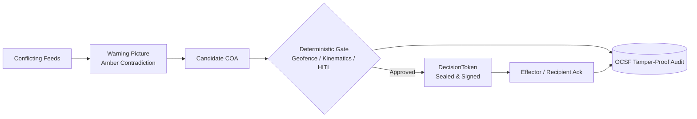
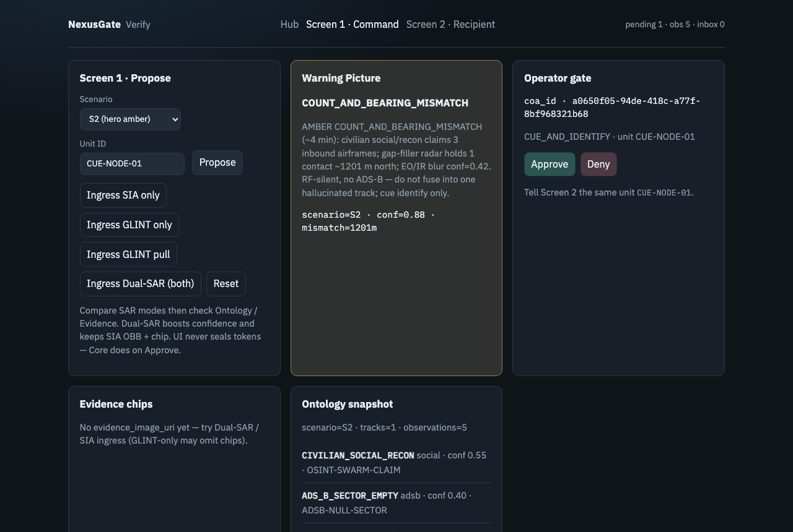
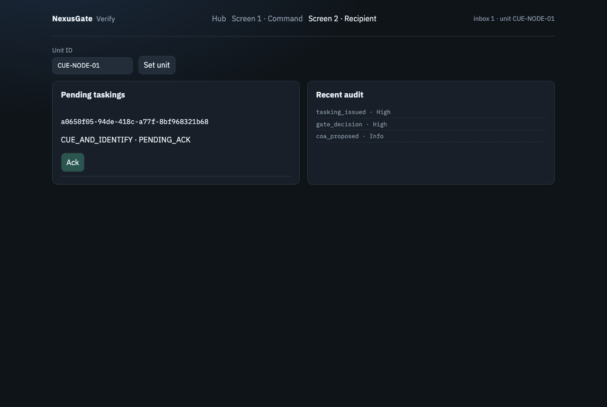

# Executive Brief: MOSAIC C2 — Powered by NexusGate Core

> **"We don’t just fuse the picture. We govern the action with deterministic certainty."**

**MOSAIC C2** is a deterministic Command-and-Control (C2) governance application built for SDTH 2026 Problem Statement 04 (*One Picture, Many Eyes*). It bridges the critical operational gap between multi-sensor contradiction detection and verifiable tactical effector tasking. **NexusGate** (`core/`) is the sovereign-neutral verification engine that seals tasking.

---

## 1. Problem Statement: The Picture-to-Tasking Gap

Singapore WOG maritime coordinators (**SMCC / MSTF**, **SPF PCG → RSN** escalation, **MPA** VTIS/STRAITREP) and C4 evaluators (**DSTA / MINDEF·SAF C4I / MDA**) have access to multiple sensor feeds (Radar, AIS, Space SAR, EO/IR, Social OSINT). However, existing systems break down when translating conflicting pictures into actionable field tasking:

1. **Sensor Contradictions Without Shared IDs:** Feeds disagree on timestamps, positions, and counts.
2. **The Over-Fusion Trap:** Forcing conflicting signals into one "fused" picture causes AI/heuristic hallucinations (e.g., phantom drone swarms or blended tracks).
3. **The Under-Processing Trap:** Avoiding automated fusion forces operators into slow, informal verbal tasking lacking cryptographically sealed authority or audit trails.

---

## 2. Our Solution: Two-Layer Architecture

NexusGate decouples **probabilistic situational awareness** from **deterministic action governance**:



* **Layer 1: Probabilistic Warning Picture (`app/`)**  
  Ingests raw, contradictory data into a `SpatialEntityGraph`. Instead of guessing a single fused track, it surfaces an **Amber Finding** (e.g., *Count & Bearing Mismatch*) and recommends a candidate Course of Action (COA).
* **Layer 2: Deterministic Action Gate (`core/`)**  
  Enforces hard rules (<50ms fast-reject on geofence, velocity, and duplicates). Enforces a latency-bounded Human-in-the-Loop (HITL) approval window. Upon approval, seals a cryptographic `DecisionToken` and tracks effector execution through a closed-loop `Recipient Ack`, logged to an immutable Open Cybersecurity Schema Framework (OCSF) audit trail.

---

## 3. Operational Scenarios

| ID | Operational Focus | Sensor Contradiction | Deterministic Action |
|----|-------------------|----------------------|----------------------|
| **S1** | **Sea Approach** | Spoofed AIS stationary vs. ~20 kt radar/EO blur (~850m offset) | `ISR_IDENTIFY_CONTACT` dispatched to verify track |
| **S3** | **Shipping Lane** *(Hero)* | Space SAR cluster (Sentinel-1) vs. AIS radio silence + coastal radar | `APPROACH_PATROL` via dead-reckoning kinematics |
| ⛔ ~~S2~~ | ~~Air Corridor~~ | **Out of scope** — air / drone domain dropped 2026-09-20 (100% maritime). Discrepancy mechanism reused by S1 / S3; not pitched. | — |

---

## 4. Key Measured Metrics

* **Total decision time (primary):** `CandidateEvent` ingress → approval committed, measured **A/B against a manual swivel-chair baseline**. Reported as measured median and spread — we do not pre-commit a number. *Caveat: n≈4 operators on synthetic scenarios; not a claim about trained watchkeepers under stress.*
* **Effector Ack roundtrip:** `< 3.0 s`, with the recipient running as a **separate OS process** so the Ack is genuinely received rather than self-dealt.
* **Gate latency (secondary):** `< 50 ms` deterministic rule evaluation and token sealing. Table stakes, not the differentiator.
* **Audit chain:** OCSF JSONL capturing every state transition and operator ID, **re-verified by a separate binary** (`eds audit verify-chain`). *Caveat: this detects tampering, it does not prevent it.*
* **Tracking continuity (UNCLOS Art. 111):** every asset handoff recorded with its gap, so non-interruption of pursuit is machine-verifiable. *Caveat: continuity of our records, not a legal finding.*
* **Architectural Safety:** Probabilistic layers (including LLMs) are strictly restricted to proposing; **only deterministic code seals action tokens**.

> Withdrawn 2026-09-21: `0 unauthorized` and `100% audit integrity`. Absolutes are unfalsifiable and invite the audit an evaluator will run anyway — see [PLAN §5](plan.md#5-quantitative-operational-benchmarks-slide-11-proof).

---

## 5. Live Demonstration in 60 Seconds

### Quickest Command-Line Proof
```bash
uv sync
./scripts/demo.sh                 # default SCENARIO=S3 (maritime hero)
```

### Two-Screen Interactive Closed Loop
```bash
# 1. Start MOSAIC C2 / NexusGate Core
uv run sdth-c2-server

# 2. Commander Action (Screen 1):
#    Open http://127.0.0.1:8080/verify/command -> Propose S3 -> Click Approve

# 3. Field Effector Action (Screen 2):
#    Open http://127.0.0.1:8080/verify/recipient -> Click Ack

# Result: OCSF audit log confirms tamper-proof closed loop.
```

| Screen 1: Command Cockpit | Screen 2: Field Recipient |
|:---:|:---:|
|  |  |
| *Amber Warning Picture & Human Operator Approval* | *Field Effector Tasking Inbox & Authenticated Ack* |

---

* **Docs Site:** [https://edgesentry.github.io/sdth-nexus-c2](https://edgesentry.github.io/sdth-nexus-c2/)  
* **Repository:** [https://github.com/edgesentry/sdth-nexus-c2](https://github.com/edgesentry/sdth-nexus-c2)
