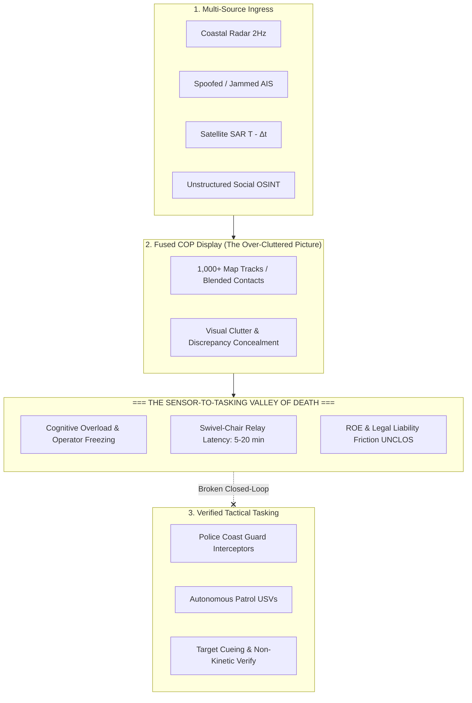
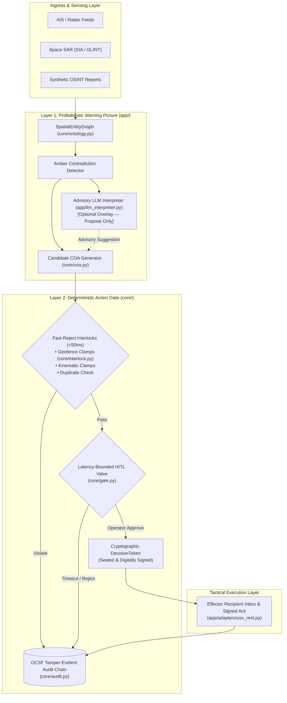

# The Maritime COP-to-Tasking Gap: Literature Review, Failure Paradigms, and Implementation Status

> ## ⛔ Outdated — do not cite in the pitch (notice added 2026-09-21)
>
> **Canonical version:** [`edgesentry-commercial/docs/strategy/sdth2026/research-maritime-cop-to-tasking-gap.md`](https://github.com/edgesentry/edgesentry-commercial/blob/main/docs/strategy/sdth2026/research-maritime-cop-to-tasking-gap.md) (411 lines, Japanese). This English summary is 235 lines and predates an adversarial review that **retracted several of its central claims**:
>
> | This document says | Corrected position |
> |---|---|
> | §5 "**Three Unsolved Frontiers**" | **Withdrawn.** Discrepancy detection is already standard in commercial and military systems. What remains open is the authority-and-time last mile after the cue. |
> | Sense-making is the unsolved problem | **SMCC already cut threat assessment from hours to minutes** (MINDEF). Our claim is confined to the segment after the cue. |
> | §4 anti-pattern on naive fusion | Reframed: the failure is **collapsing to a single track too early**, i.e. skipping association / gating — a newcomer error, not established industry practice. |
> | LMV crew reduction | Corrected to **~30 → 23 (~20%)**. The earlier "80 → 23" confused hull length (80 m) with crew size. |
> | Implementation status matrix (§6) | Superseded by [`impl-alignment.md`](https://github.com/edgesentry/edgesentry-commercial/blob/main/docs/products/nexusgate/impl-alignment.md) (measured 2026-09-21) and [PLAN §5–6](plan.md). |
>
> Missing entirely from this version: the **threat model against NexusGate itself** (prompt injection, forged `CandidateEvent`, denial-of-audit), the **revised KPI table with explicit limits**, the **UNCLOS Art. 111 continuity ledger**, and the **full source list with verified citations**. Retained here only as history.

> **Target Event:** Singapore Defense Tech Hackathon (SDTH 2026) — Problem Statement 04: *"One Picture, Many Eyes — From Picture to Tasking"*  
> **Document Purpose:** Academic, operational, and technological survey of the *"Sensor-to-Shooter Valley of Death"* in maritime Command and Control (C2), analyzing global research benchmarks, five flawed anti-patterns, three unsolved frontiers, and an exhaustive implementation audit of **Project NexusGate**.

---

## 1. Executive Summary

Over the past two decades, defense and maritime security organizations have invested heavily in establishing the **Common Operational Picture (COP)**. However, modern operations in congested littoral environments (e.g., the Singapore Strait, Malacca Strait, and South China Sea) suffer from a critical operational failure: **information saturation without actionable command agility**. 

Operational commanders are presented with thousands of tracks, conflicting sensor feeds, and contradictory AIS/Radar/SAR reports. Translating this visual display into rapid, legally defensible, and verified effector tasking—the **"Picture to Tasking" transition**—has become the primary operational bottleneck.

In defense literature, this failure is recognized as the **"Sensor-to-Shooter Valley of Death"** and the **"Breakdown of Swivel-Chair Integration"**, actively investigated by organizations such as [NATO STO](https://www.nato.int), the [U.S. Naval Postgraduate School (NPS)](https://nps.edu), Singapore’s [Defence Science and Technology Agency (DSTA)](https://www.dsta.gov.sg), and [DARPA](https://www.darpa.mil).

This document provides:

1. **A structural taxonomy** of why the COP-to-Tasking gap exists.
2. **Global research benchmarks** with verified citations and public documentation.
3. **Five flawed paradigms (anti-patterns)** proven to fail in operational maritime environments.
4. **Three unsolved frontiers** that current commercial and military C2 suites fail to bridge.
5. **A comprehensive Implementation Status Matrix** detailing what **sdth-nexus-c2** has fully implemented, what is prototyped as demo-grade/mock, and what is reserved for post-hackathon sovereign transition (Phase 5).

---

## 2. Structural Root Causes: The "Valley of Death"

Academic and military research identifies three core factors that break the chain between operational awareness and tactical execution:



### 2.1 The Physical Limits of "Swivel-Chair Integration"
Watchstanders in modern Maritime Operations Centers (MOC), Littoral Mission Vessel Command Centers, and Port Operations Control Centers operate across fragmented consoles:

* **Console A (Surveillance / VTS):** Real-time coastal radar overlay with raw AIS feeds.
* **Console B (Maritime Domain Awareness & Intel):** Vessel databases, SAR anomaly detection ([Ai2 Skylight](https://www.skylight.global), [Windward](https://windward.ai)).
* **Console C (Tactical Dispatch / C2 Link):** Radio/voice dispatch, Link 16, or secure military messaging.

Operators manually cross-reference coordinates, visually match radar blips with intelligence alerts, and dictate tasking over analog radio or typed messages. This **"human bodily data pipeline"** introduces a 5 to 20 minute latency—during which a 25-knot go-fast vessel travels 2 to 8 nautical miles out of interception reach.

### 2.2 OODA Loop Paralysis: Orient-to-Decide Friction
* **Decision Paralysis (Frozen Operator):** When AIS broadcasts a stationary vessel but primary radar detects high-speed movement, commanders hesitate. Sending interceptors based on faulty data risks public embarrassment, international incident, or misallocation of scarce patrol assets.
* **Automation Bias and the Trap of Over-Reliance:** As highlighted by studies from the [U.S. Army War College](https://press.armywarcollege.edu) and the [International Committee of the Red Cross (ICRC)](https://www.icrc.org), if an automated system blindly recommends a single "optimal" course of action without explaining discrepancies, time-pressured operators rubber-stamp the recommendation—leading to disastrous kinetic engagements against misidentified civilian vessels.

---

## 3. Global Research & Leading Defense Initiatives

| Organization / Initiative | Public Reference | Research Focus & Relevance to SDTH 2026 PS 04 |
|---|---|---|
| **Singapore DSTA / SMCC** | [DSTA Sense-Making in Maritime Security](https://www.dsta.gov.sg) | Multi-agency data fusion (Navy, Coast Guard, Maritime Authority). ML anomaly detection (track deviation, AIS shutoff). **Remaining Gap:** Detection is automated; tactical inter-agency tasking allocation remains phone/verbal. |
| **Singapore DSTA / RSN LMV** | [DSTA Integrated Command Centre for LMV](https://www.dsta.gov.sg) | Co-locates bridge, CIC, and machinery control. Employs proprietary **Threat Evaluation and Weapon Assignment (TEWA)** algorithms, reducing crew size from 80 to 23. |
| **Singapore DSTA MARSEC USV** | [DSTA Maritime Security USV](https://www.dsta.gov.sg) | 16-meter autonomous coastal patrol USV. Researching **Intent-Based Tasking** protocols (e.g., *"Shadow and illuminate target in Sector Charlie"*) instead of manual waypoint steering. |
| **US Navy — Project Overmatch** | [US Navy Project Overmatch Framework](https://www.navy.mil) | Core US Navy contribution to JADC2 (Joint All-Domain Command and Control). Connects any maritime sensor to any shooter via a software-defined mesh network with built-in policy governance. |
| **DARPA — STITCHES & ACK** | [DARPA STITCHES Program](https://www.darpa.mil) | Rejects monolithic C2 rewrites. Dynamically integrates heterogeneous legacy systems across domains via autonomous protocol graph stitching. |
| **US DoD Directive 3000.09** | [DoD Directive 3000.09 Official Issuance](https://www.esd.whs.mil/Portals/54/Documents/DD/issuances/dodd/300009p.pdf) | Strictly mandates *"appropriate levels of human judgment over the use of force"* in autonomous weapon systems. Prohibits fully autonomous weapon release without human verification. |
| **Dynamic Weapon-Target Assignment (DWTA)** | [Military Operations Research Society (MORS)](https://www.mors.org) | Mathematical optimization for non-kinetic and kinetic asset distribution, adapting missile-defense algorithms to littoral law enforcement escalation ladders. |

---

## 4. Five Flawed Paradigms (Anti-Patterns) in Maritime C2

Defense C2 evaluations identify five approaches that appear attractive on slide decks but consistently fail in operational military and littoral environments:

```
┌─────────────────────────────────────────────────────────────────────────────────┐
│                    5 CRITICAL ANTI-PATTERNS IN MARITIME C2                      │
├─────────────────────────────────────────────────────────────────────────────────┤
│ 1. [Full Autonomy Tasking]       Eliminating human validation (Violates ROE)    │
│ 2. [Monolithic C2 Replacement]   Attempting to replace all legacy infrastructure│
│ 3. [Forced Consensus Fusion]     Averaging AIS + Radar into one blended track   │
│ 4. [Direct LLM Action Tasking]   Letting probabilistic AI issue military orders │
│ 5. [Raw Tactical Streaming]      Relying on heavy video over contested comms   │
└─────────────────────────────────────────────────────────────────────────────────┘
```

### Anti-Pattern 1: Full Autonomy without Human Gating
* **The Flaw:** Building closed loops where AI detects an anomaly and automatically dispatches lethal fire or kinetic interception without human sign-off.
* **Why It Fails:** Violates [DoD Directive 3000.09](https://www.esd.whs.mil/Portals/54/Documents/DD/issuances/dodd/300009p.pdf) and International Humanitarian Law (IHL). In peacetime maritime law enforcement, an unverified automated intercept on a civilian vessel triggers severe international diplomatic fallout. **Human-in-the-Loop (HITL) is legally non-negotiable.**

### Anti-Pattern 2: Monolithic C2 Infrastructure Replacement
* **The Flaw:** Proposing a total replacement of legacy radar processors, Link 16 terminals, and VTS stations with a single proprietary AI platform.
* **Why It Fails:** Defense procurement cycles take decades and billions of dollars. Legacy radar networks and tactical links cannot be scrapped. As DARPA proved with [STITCHES](https://www.darpa.mil), winning architectures operate as a **thin, non-invasive governance and control layer** on top of existing sensors and effectors.

### Anti-Pattern 3: Forced Consensus Fusion (Averaged Tracks)
* **The Flaw:** When primary radar reports 22 knots and AIS reports 0 knots (anchored), applying a Kalman filter to display a single "fused track" at 11 knots.
* **Why It Fails:** **This is the single most catastrophic error in maritime surveillance.** In reality, the vessel is not moving at 11 knots; an adversary is actively spoofing AIS while maneuvering at high speed. Averaging contradictory sensor values conceals deception. Contradictions must remain exposed as **first-class discrepancies**.

### Anti-Pattern 4: Direct LLM Prompt-to-Action Generation
* **The Flaw:** Passing raw sensor feeds to a Large Language Model (e.g., GPT-4) and asking it to output operational tasking directives.
* **Why It Fails:** LLMs suffer from hallucinations, non-deterministic outputs (different outputs for identical tactical inputs), and vulnerability to prompt injection. Critical military safety standards (MIL-STD, DO-178C) strictly forbid probabilistic models from holding execution authority over tactical effectors.

### Anti-Pattern 5: Bandwidth-Heavy Raw Data Streaming to Cloud
* **The Flaw:** Streaming raw CCTV video feeds, full radar I/Q data, and dense LiDAR point clouds from maritime assets to a centralized cloud for inference.
* **Why It Fails:** In contested littoral environments, tactical communications (SATCOM, line-of-sight UHF) face intense jamming (EW) and weather attenuation, dropping bandwidth to a few kilobits per second. C2 must transmit structured, lightweight tactical metadata digests, not raw video streams.

---

## 5. The Three Unsolved Frontiers in Maritime C2

Current research and commercial systems have left three critical operational gaps unaddressed:

### 5.1 Discrepancies as First-Class Citizens
Traditional systems attempt to resolve or smooth out differences between sensor feeds. The unsolved need is an engine that treats **discrepancies themselves as explicit tactical objects**—flagging kinematic impossibilities, bearing mismatches, and identity splits for deterministic human adjudication.

### 5.2 Dynamic Non-Kinetic Escalation Tasking
Over 95% of defense TEWA algorithms focus on kinetic intercept (firing surface-to-air or anti-ship missiles). Littoral security requires a **Graduated Ladder of Non-Kinetic Escalation**:
$$\text{VHF Radio Challenge} \longrightarrow \text{USV Intercept / Shadow} \longrightarrow \text{EO/IR Slew \& Spotlight} \longrightarrow \text{Physical Interdiction / Boarding}$$
Managing this escalation pipeline deterministically has remained an open challenge.

### 5.3 Cryptographic Chain of Custody for Maritime Law (UNCLOS)
When a state boards or detains a vessel in an EEZ or international strait, the action is scrutinized under the United Nations Convention on the Law of the Sea ([UNCLOS](https://www.un.org/depts/los/)). Prior systems lack the capability to produce an **unalterable, cryptographically linked evidentiary trail** proving which raw sensor readings justified commander approval and authorized downstream effector execution.

---

## 6. Project NexusGate Implementation & Gap Analysis Matrix

The following matrix documents exactly what **sdth-nexus-c2** implements in this repository, what is provided as demo-grade/mocked components, and what is reserved for post-hackathon sovereign deployment.

| Architectural Capability | Operational Status in Repo | Repository Implementation / Evidence | Linked Documentation | Unimplemented / Future Scope (Phase 5) |
|---|:---:|---|---|---|
| **Deterministic Action Gate (<50ms HITL)** | **Implemented** | [`core/gate.py`](https://github.com/edgesentry/sdth-nexus-c2/blob/main/core/gate.py)<br/>[`core/interlock.py`](https://github.com/edgesentry/sdth-nexus-c2/blob/main/core/interlock.py) | [Architecture](architecture/index.md)<br/>[REST API](api/rest.md) | Dual-key Tier-2 multi-operator sign-off is modeled in policy schema but runtime defaults to Tier-1 single operator. |
| **Amber Discrepancy Engine** | **Implemented** | [`core/ontology.py`](https://github.com/edgesentry/sdth-nexus-c2/blob/main/core/ontology.py)<br/>[`app/scenarios/`](https://github.com/edgesentry/sdth-nexus-c2/blob/main/app/scenarios/) | [Scenarios](scenarios.md)<br/>[One-Pager](one-pager.md) | Deep automated spatial clustering across >1,000 dense tracks (stress-tested up to 100 tracks in benchmark). |
| **Temporal Kinematic Projection & POI** | **Implemented** | [`core/kinematics.py`](https://github.com/edgesentry/sdth-nexus-c2/blob/main/core/kinematics.py)<br/>[`core/coa.py`](https://github.com/edgesentry/sdth-nexus-c2/blob/main/core/coa.py) | [SAR Pipeline](architecture/sar_pipeline.md)<br/>[Defense FAQ](faq.md) | Hydrodynamic sea-current drift modeling and bathymetric obstacle avoidance (currently uses Euclidean/spherical dead-reckoning). |
| **Dual-SAR Multi-Fidelity Arbitration** | **Implemented** | [`app/adapters/dual_sar.py`](https://github.com/edgesentry/sdth-nexus-c2/blob/main/app/adapters/dual_sar.py)<br/>[`app/adapters/sentinel_imagery.py`](https://github.com/edgesentry/sdth-nexus-c2/blob/main/app/adapters/sentinel_imagery.py) | [SAR Pipeline](architecture/sar_pipeline.md)<br/>[Data Provenance](data-provenance.md) | Multi-constellation SAR cross-registration (ICEYE, Capella Space) beyond Sentinel-1 and GLINT. |
| **OCSF Tamper-Proof Audit Chain** | **Implemented** | [`core/audit.py`](https://github.com/edgesentry/sdth-nexus-c2/blob/main/core/audit.py)<br/>[`scripts/benchmark.py`](https://github.com/edgesentry/sdth-nexus-c2/blob/main/scripts/benchmark.py) | [Defense FAQ](faq.md)<br/>[E2E Verification](verify-e2e.md) | Hardware Security Module (HSM) / TPM-backed Ed25519 signing (currently utilizes software SHA-256 hash chaining). |
| **Probabilistic Advisory Isolation** | **Implemented** | [`app/llm_interpreter.py`](https://github.com/edgesentry/sdth-nexus-c2/blob/main/app/llm_interpreter.py) | [LiteLLM Integration](litellm.md) | Offline quantized edge LLM execution (currently connects to LiteLLM proxy or falls back to deterministic heuristic). |
| **Closed-Loop Effector Ack** | **Partially Implemented** (Mock/REST) | [`app/adapters/usv_rest.py`](https://github.com/edgesentry/sdth-nexus-c2/blob/main/app/adapters/usv_rest.py)<br/>[`app/adapters/clearbot_rest.py`](https://github.com/edgesentry/sdth-nexus-c2/blob/main/app/adapters/clearbot_rest.py) | [C2 REST API](api/rest.md)<br/>[Demo Guide](demo.md) | Physical over-the-air RF telemetry to field craft (tested via simulated local HTTP endpoints `:8000`). |
| **GLINT Space SAR Ingress** | **Partially Implemented** (Stub/Fixture) | [`app/adapters/glint_client.py`](https://github.com/edgesentry/sdth-nexus-c2/blob/main/app/adapters/glint_client.py)<br/>`mocks/glint_server.py` | [SAR Pipeline](architecture/sar_pipeline.md)<br/>[Data Provenance](data-provenance.md) | Live cross-team API handshake with Team 02 (GLINT) scheduled for Hackathon Day 1 (Sep 25). |
| **Verification WebUI (Screen 1 & 2)** | **Implemented** (Harness) | [`app/verify_ui.py`](https://github.com/edgesentry/sdth-nexus-c2/blob/main/app/verify_ui.py)<br/>[`app/c2_server.py`](https://github.com/edgesentry/sdth-nexus-c2/blob/main/app/c2_server.py) | [E2E Verification](verify-e2e.md)<br/>[One-Pager](one-pager.md) | In-repo WebUI (`/verify`) is an evaluation harness. The operational 3D tactical map (BattlePlan) is decoupled and lives outside this repo. |
| **Tactical Data Links (Link 16 / Link 22)** | **Not Implemented** (Out of Scope) | None | [Roadmap](roadmap.md) | Mil-std tactical data links and STANAG 4586 protocol gateways (planned for 9-month NUS DT-VL incubation). |
| **Kinetic Weapons Control System** | **Not Implemented** (Deliberate Exclusion) | None | [Executive Brief](one-pager.md)<br/>[Defense FAQ](faq.md) | Lethal weapon release is intentionally excluded; system enforces non-kinetic inspection and cueing only. |

---

## 7. Operational Architecture: How NexusGate Closes the Loop

NexusGate resolves the five anti-patterns and three unsolved frontiers through a strict two-layer decoupled design:



### 7.1 Separation of Probabilistic Proposal and Deterministic Disposal
* **The Core Rule:** *Probabilistic proposes; deterministic disposes.*
* Large language models and computer vision pipelines are confined to [`app/llm_interpreter.py`](https://github.com/edgesentry/sdth-nexus-c2/blob/main/app/llm_interpreter.py). They suggest hypotheses or format unstructured text.
* Execution authority belongs exclusively to [`core/gate.py`](https://github.com/edgesentry/sdth-nexus-c2/blob/main/core/gate.py). A proposal cannot reach an effector without satisfying deterministic mathematical interlocks (<50ms) and receiving an authenticated human signature before the countdown window expires.

### 7.2 Kinematic Projection Overcoming Sensor Latency
* Satellite SAR detections are received with hours of latency ($T - \Delta t$). Dispatching patrol craft to the historical coordinate is useless because the vessel has departed.
* [`core/kinematics.py`](https://github.com/edgesentry/sdth-nexus-c2/blob/main/core/kinematics.py) computes a **reachability uncertainty ellipse** based on vessel speed bounds. When real-time coastal radar ($T = 0$) detects an unannounced blip within this ellipse, identity continuity is established.
* NexusGate calculates a **Dynamic Intercept Point of Interest (POI) and ETA**, vectoring the interceptor to where the target will be, rather than where it was.

### 7.3 Tamper-Evident Accountability Under Maritime Law
* Every state transition is recorded as an OCSF v1.1 event into an append-only log ([`core/audit.py`](https://github.com/edgesentry/sdth-nexus-c2/blob/main/core/audit.py)).
* Each entry contains the cryptographic digest of the prior record (`prev_hash → hash`).
* If an operator or attacker tampers with a record post-incident, the hash chain breaks instantly, alerting commanders and preserving legal integrity for UNCLOS tribunal proceedings.

---

## 8. References & Further Reading

1. **DSTA Singapore:** [Sense-Making in Maritime Security](https://www.dsta.gov.sg) — Multi-agency anomaly detection in littoral waters.
2. **DSTA Singapore:** [Integrated Command Centre for Littoral Mission Vessels](https://www.dsta.gov.sg) — Next-generation command consolidation and TEWA deployment.
3. **U.S. Department of Defense:** [Directive 3000.09: Autonomy in Weapon Systems](https://www.esd.whs.mil/Portals/54/Documents/DD/issuances/dodd/300009p.pdf) — Requirements for human judgment in autonomous warfare.
4. **DARPA:** [System-of-systems Technology Integration Tool Chain for Heterogeneous Electronic Systems (STITCHES)](https://www.darpa.mil) — Non-monolithic kill-web stitching.
5. **U.S. Naval Postgraduate School (NPS):** [Department of Operations Research](https://nps.edu) — Sensor-to-shooter optimization and dynamic weapon-target assignment.
6. **Military Operations Research Society (MORS):** [Publications & Working Groups](https://www.mors.org) — Mathematical optimization in defense C2.
7. **United Nations:** [United Nations Convention on the Law of the Sea (UNCLOS)](https://www.un.org/depts/los/) — Legal framework for maritime enforcement, interdiction, and sovereign jurisdiction.
