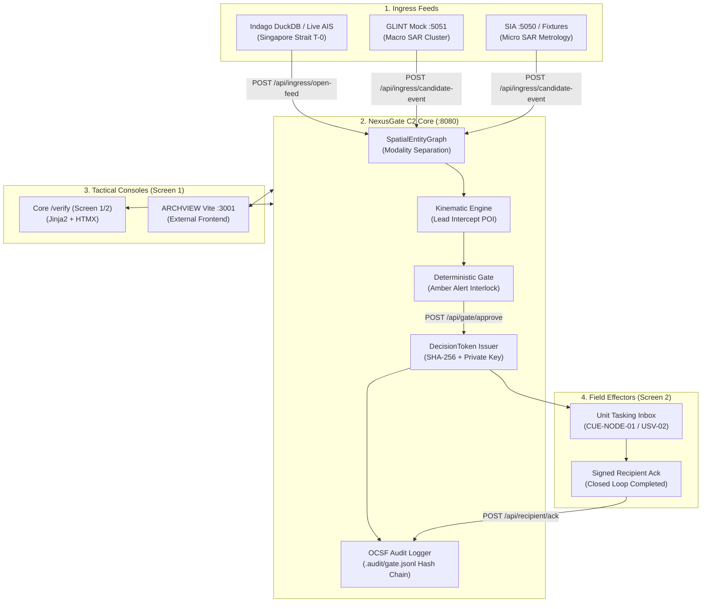

# End-to-End Verification (NexusGate)

Comprehensive runbook for executing and validating the full **Picture → Gate → Ack** closed loop starting from a **clean zero-state reset** (all processes stopped, state cleared) to end-to-end execution and cryptographic data verification.

- **Primary Scenario**: **Hero S3 (Singapore Strait Dark Vessel Interdiction via Dual-SAR & AIS)**
- **Console UIs**: Core `/verify` (Jinja2/HTMX Screen 1/2) or external **ARCHVIEW** tactical console (`:3001`)
- **Key Specifications**: [C2 REST API](api/rest.md) · [Demo Guide](demo.md) · [Data Provenance](data-provenance.md) · [SAR Pipeline](architecture/sar_pipeline.md) · [Architecture Map](architecture/index.md)

---

## 0. System Topology & Port Allocations

| Component | Port | Startup Command | Status | Role |
|---|---|---|---|---|
| **NexusGate Core** | `:8080` | `uv run sdth-c2-server` | **Required** | C2 server, in-memory ontology graph, deterministic gate, OCSF audit seal, `/verify` UI |
| **GLINT Mock** | `:5051` | `uv run sdth-mock-glint` | Optional (Live pull) | Team 02 GLINT macro SAR corridor anomaly cluster mock |
| **SIA Upstream** | `:5050` | `uv run sia-server` | Optional (Live pull) | In-house Sentinel-1 micro SAR CV metrology (automatic fail-safe fallback when offline) |
| **USV Effector Mock** | `:8000` | `uv run uvicorn mocks.usv:app --port 8000` | Optional (Demo script) | CLEARBOT / autonomous USV telemetry & tasking mock |
| **ARCHVIEW Vite** | `:3001` | `npm run dev` | Optional (ARCHVIEW) | External React/Vite tactical command cockpit (Screen 1) |
| **ARCHVIEW BFF** | `:3102` | `npm run dev:api` | Optional (ARCHVIEW) | Evidence image/video BFF server |



---

## 1. Zero-State Clean Reset

Follow these steps to kill any lingering processes, clear local storage and audit trails, and ensure a completely clean environment before running the E2E verification.

### 1.1 Terminate Running Processes

Stop any existing C2, mock, or frontend processes and free ports `:8080`, `:5051`, `:5050`, `:8000`, `:3001`, and `:3102`:

```bash
# Terminate processes occupying target ports
kill $(lsof -ti :8080 :5051 :5050 :8000 :3001 :3102) 2>/dev/null || true

# Verify that all ports are freed (should return empty output)
lsof -i :8080 -i :5051 -i :5050 -i :8000 -i :3001 -i :3102
```

### 1.2 Clear Audit Trails, Scratch Directories & Cache

Wipe previous audit records (`.audit/`), temporary test files (`.tmp-e2e/`), and compiled Python cache:

```bash
cd /Users/yoheionishi/work/edgesentry/sdth-nexus-c2

# Remove existing audit trails and temporary artifacts
rm -rf .audit/gate.jsonl .audit/ingress.jsonl .tmp-e2e/
mkdir -p .audit

# Clean Python bytecode caches
find . -type d -name "__pycache__" -exec rm -rf {} + 2>/dev/null || true
```

### 1.3 Sync Environment & Dependencies

```bash
uv sync
```

---

## 2. Server Startup Options

Select the deployment profile appropriate for your verification target:

### Profile A: Core Only (Minimal & Recommended)

No external processes (Node.js, SIA, or GLINT server) are required. C2 uses built-in fail-safe fixtures that emulate identical Dual-SAR fusion and closed-loop gating behavior.

```bash
# Terminal 1: Start C2 Core
cd /Users/yoheionishi/work/edgesentry/sdth-nexus-c2
export C2_DEMO_TAMPER=1
uv run sdth-c2-server
# => Running on http://127.0.0.1:8080
```

### Profile B: Full-Spectrum (With Live GLINT Mock)

To verify live macro SAR HTTP polling alongside SIA micro SAR fail-safe:

```bash
# Terminal 1: C2 Core
cd /Users/yoheionishi/work/edgesentry/sdth-nexus-c2
export C2_DEMO_TAMPER=1
uv run sdth-c2-server

# Terminal 2: GLINT Mock (:5051)
cd /Users/yoheionishi/work/edgesentry/sdth-nexus-c2
uv run sdth-mock-glint
```

### Profile C: ARCHVIEW Tactical Console Integration

```bash
# Terminal 1: C2 Core (:8080)
cd /Users/yoheionishi/work/edgesentry/sdth-nexus-c2
uv run sdth-c2-server

# Terminal 2: ARCHVIEW Tactical Console (:3001) & BFF (:3102)
cd /path/to/SDTH-2026
npm run dev:api &   # Starts BFF on :3102
npm run dev         # Starts Vite on :3001
```

### Startup Health Verification

Verify responsiveness in a separate terminal:

```bash
curl -sf http://127.0.0.1:8080/health | jq .
# Expected: {"status": "ok"}

curl -sf http://127.0.0.1:8080/api/audit/health | jq .
# Expected: {"verified": true, "broken": 0, "count": 0, "label": "0 of 0"}
```

---

## 3. End-to-End Execution Workflows

### Workflow 1: One-Shot Automated E2E (CLI)

Executes the complete Propose → Approve → Inbox → Ack → Audit closed loop in `< 10ms`:

```bash
# Run S3 Maritime Hero closed loop
SCENARIO=S3 uv run python scripts/picture_to_tasking.py --require-roundtrip
```

**Expected output**:
```text
picture_to_tasking S3: PASS
Picture→Ack: 0.005s | Approve→Ack: 0.003s
recipient_ack sealed; cryptographic audit chain intact (3 links)
```

---

### Workflow 2: Core WebUI (`/verify`) Rehearsal

Interactive human-in-the-loop (HITL) verification using dual browser tabs:

1. **Open Consoles**:
   - **Screen 1 (Command Cockpit)**: [http://127.0.0.1:8080/verify/command](http://127.0.0.1:8080/verify/command)
   - **Screen 2 (Recipient Effector)**: [http://127.0.0.1:8080/verify/recipient](http://127.0.0.1:8080/verify/recipient)
2. **Ingress Sensor Data on Screen 1**:
   - Click **Ingress Dual-SAR (both)** → Ontology snapshot displays 2 dark vessels ($L=78.2\text{ m}, 52.0\text{ m}$) with attached high-resolution radar evidence chips.
   - Click **Ingress Indago AIS** → Overlays ~40 live/synthetic commercial background tracks in the Singapore Strait without entity blending.
3. **Propose Action**:
   - Select Scenario **S3** (Maritime Hero / Dark Vessel) → Click **Propose**.
   - Verify that the **Amber Warning Card** (`SAR_DARK_CLUSTER_VS_AIS_SILENCE`) and **Lead POI Card** (quadratic intercept calculation) are rendered.
4. **Authorize (Approve)**:
   - Within the approval countdown window (typically 30s), click **Approve**.
   - An `APPROVED` status badge appears, and the cryptographically sealed `DecisionToken` digest is generated.
5. **Acknowledge on Screen 2 (Ack)**:
   - Switch to Screen 2. HTMX auto-polling (every 2s) populates the tasking for unit `CUE-NODE-01`.
   - Click **Ack**.
   - Status updates to `ACKED`, and the audit chain counter increments.

---

### Workflow 3: Complete Command-Line (curl) Closed Loop

Replicate the entire operational flow via REST API calls without a browser:

```bash
export C2=http://127.0.0.1:8080

# 1. Reset in-memory state
curl -sf -X POST "$C2/api/admin/reset" | jq .
# Expected: {"status": "reset"}

# 2. Ingest background AIS traffic (Indago DuckDB or Fixture)
curl -sf -X POST "$C2/api/ingress/open-feed" \
  -H 'content-type: application/json' \
  -d '{"feed":"all","use_fixture":true}' | jq '{status, count, resolved: .resolved_sources}'
# Expected: status: "INGESTED", count >= 40

# 3. Ingest Dual-SAR anomaly (GLINT macro cue + Sentinel-1 micro metrology)
curl -sf -X POST "$C2/api/ingress/candidate-event" \
  -H 'content-type: application/json' \
  -d '{"dual_sar":true}' | jq '{source, count, ids:[.observations[].source_id]}'
# Expected: source: "dual_sar", count: 2, ids: ["DUAL_SAR", "DUAL_SAR"]

# 4. Propose S3 Course of Action
PROP=$(curl -sf -X POST "$C2/api/gate/proposals" \
  -H 'content-type: application/json' \
  -d '{"scenario_id":"S3","unit_id":"CUE-NODE-01"}')
COA_ID=$(echo "$PROP" | jq -r '.coa.coa_id')
echo "=== Proposal Created: COA $COA_ID ==="
echo "$PROP" | jq '{status, amber: .finding.amber_alert, threat: .finding.threat_class, poi: .coa.target_coordinates}'

# 5. Commander Approve -> Seals DecisionToken
APPROVE=$(curl -sf -X POST "$C2/api/gate/approve" \
  -H 'content-type: application/json' \
  -d "{\"coa_id\":\"$COA_ID\",\"decision\":\"y\",\"operator_id\":\"commander-01\"}")
echo "$APPROVE" | jq '{status, coa_id: .coa.coa_id, token_digest: .decision_token.token_digest}'

# 6. Recipient Effector Inbox Inspection
curl -sf "$C2/api/recipient/inbox?unit_id=CUE-NODE-01" | jq '{count, tasking_coa: .taskings[0].coa.coa_id}'

# 7. Recipient Effector Execution Acknowledgment (Ack)
curl -sf -X POST "$C2/api/recipient/ack" \
  -H 'content-type: application/json' \
  -d "{\"coa_id\":\"$COA_ID\",\"unit_id\":\"CUE-NODE-01\",\"status\":\"ACKED\"}" | jq .

# 8. Cryptographic Audit Health Check
curl -sf "$C2/api/audit/health" | jq .
```

---

### Workflow 4: Path ARCHVIEW (Hero S3) {#path-archview-hero-s3--issue-99}

Closed-loop execution combining external **ARCHVIEW** (Vite `:3001`) with Core (`:8080`):

```bash
# 1. Reset Core & Ingest Dual-SAR
curl -sf -X POST http://127.0.0.1:8080/api/admin/reset >/dev/null
curl -sf -X POST http://127.0.0.1:8080/api/ingress/candidate-event \
  -H 'content-type: application/json' -d '{"dual_sar":true}' | jq '{source,count}'
# Expected: source: "dual_sar", count: 2

# 2. ARCHVIEW UI Actions (http://127.0.0.1:3001)
# - Scenario: Select S3 Maritime Hero -> Click [Propose]
# - Inspect Amber Warning ("SAR_DARK_CLUSTER_VS_AIS_SILENCE") & Lead Intercept POI
# - Click [Approve] on the HITL card within timeout (Core seals DecisionToken)

# 3. Screen 2 Recipient Ack (Abort path default)
# - Browser: http://127.0.0.1:8080/verify/recipient -> Click [Ack]
# - Or CLI:
COA_ID=$(curl -sf "http://127.0.0.1:8080/api/recipient/inbox?unit_id=CUE-NODE-01" | jq -r '.taskings[0].coa.coa_id')
curl -sf -X POST http://127.0.0.1:8080/api/recipient/ack \
  -H 'content-type: application/json' \
  -d "{\"coa_id\":\"$COA_ID\",\"unit_id\":\"CUE-NODE-01\",\"status\":\"ACKED\"}" | jq .status

# 4. Verify ARCHVIEW Audit Pill
# ARCHVIEW console audit pill displays green ("0 of n", verified: true)
curl -sf http://127.0.0.1:8080/api/audit/health | jq .
```

---

### Workflow 5: Tamper Detection Rehearsal {#tamper-detection-rehearsal-88}

Validates that a 1-character insider tampering of `gate.jsonl` is detected immediately by SHA-256 hash chaining and out-of-process EDS verification, halting execution until restored:

1. **CLI Rehearsal**:
   ```bash
   uv run python scripts/demo_tamper_detection.py
   # Expected: Exit 0 (Chain built -> 1-char tamper injected -> mismatch detected -> restored -> valid)
   ```

2. **WebUI Interactive Rehearsal**:
   - Launch with `C2_DEMO_TAMPER=1 uv run sdth-c2-server`.
   - Complete a cycle (Propose → Approve → Ack) on `/verify/command`.
   - In the **Audit integrity** panel:
     1. Click **Inject 1-char tamper** → Status badge changes to warning (`broken links 1 of n` / `hash mismatch`).
     2. Click **Re-verify** → Confirms SHA-256 and EDS out-of-process verification failure.
     3. Click **Restore** → Restores pre-tamper snapshot (`broken links 0 of n`).

---

## 4. Data Verification Procedures

Checklist for verifying data correctness, mathematical integrity, and non-repudiation at each pipeline stage.

### 4.1 Ingress & Ontology State Verification (`GET /api/ontology/state`)

Execute inspection query:
```bash
curl -sf http://127.0.0.1:8080/api/ontology/state | jq '{
  scenario: .scenario_id,
  track_count: (.tracks | length),
  obs_count: (.observations | length),
  amber: .amber_alert.alert,
  pending: .pending_proposals,
  inbox: .inbox_depth
}'
```

#### ✅ Verification Point 1: Modality Separation
- **Check**: AIS commercial tracks and SAR radar observations must **never** be prematurely blended into a single hallucinated composite track.
- **Pass Criteria**:
  - `tracks[].modalities` preserves distinct values (`["ais"]` for AIS vessels, `["space_sar"]` for SAR detections).
  - Unannounced dark vessels remain isolated as independent radar tracks rather than overwriting legitimate AIS tracks.

#### ✅ Verification Point 2: Dual-SAR Corroboration
- **Check**: Macro SAR (GLINT cluster cue) and micro SAR (Sentinel-1 metrology) spatially align within the sector corridor ($\le 3\text{ km}$ or macro bbox), yielding elevated confidence.
- **Pass Criteria**:
  - `source_id`: `"DUAL_SAR"`
  - `attributes.dual_sar_status`: `"corroborated"`
  - `confidence`: `0.98` (boosted from individual 0.91 / 0.84 scores)
  - `attributes.metrology`: Length $L=78.2\text{ m}, 52.0\text{ m}$ preserved from SIA
  - Evidence chip URL: Valid link to `/static/fixtures/sentinel_chip.jpg`

#### ✅ Verification Point 3: SAR Ingress Mode Discrepancy {#compare-sar-ingress-modes-results-must-differ}
When executing each mode after an `/api/admin/reset`, verify that outputs are observably distinct:

| Mode | Trigger Payload | Expected `source_id` | Detections | Length ($L$) | Confidence | Radar Chip |
|---|---|---|---|---|---|---|
| **SIA only** | `{"use_sentinel_fixture":true}` | `SENTINEL_IMAGERY_ANALYSIS` | **2** | $78.2\text{m}, 52.0\text{m}$ | ~0.91 / 0.84 | **Yes** (`sentinel_chip.jpg`) |
| **GLINT only** | `{"use_glint_fixture":true}` | `SPACE_SAR_SCENE_DIFF` | **1** | None (Macro cluster) | ~0.88 | **No** (Macro scene difference) |
| **Dual-SAR** | `{"dual_sar":true}` | `DUAL_SAR` | **2** | Inherited from SIA | **~0.98** (Boosted) | **Yes** (Inherited from SIA) |

---

### 4.2 Gate / Amber Warning & Lead Intercept POI Verification (`POST /api/gate/proposals`)

Inspect proposal payload:
```bash
curl -sf -X POST http://127.0.0.1:8080/api/gate/proposals \
  -H 'content-type: application/json' \
  -d '{"scenario_id":"S3","unit_id":"CUE-NODE-01"}' | jq '.finding, .coa'
```

#### ✅ Verification Point 1: Amber Alert Formulation
- `finding.amber_alert`: `"SAR_DARK_CLUSTER_VS_AIS_SILENCE"`
- `finding.threat_class`: `"lane_sar_ais_dark_cluster"`
- `finding.mismatch_m`: $\approx 4,973\text{ m}$ (spatial disparity between AIS shipping lane and anomalous radar contact)

#### ✅ Verification Point 2: Dynamic Lead Intercept Kinematics
- **Check**: Action target coordinates must not point to stale historical detection positions. Instead, the system must calculate a dynamic **Point of Interception (POI)** using quadratic collision-course kinematics ([#58](https://github.com/edgesentry/sdth-nexus-c2/issues/58)).
- **Pass Criteria**:
  - `coa.intent`: `"APPROACH_PATROL"`
  - `coa.target_coordinates`: Four-decimal latitude/longitude pair
  - `coa.metadata.poi`: Contains calculated `bearing_deg`, `speed_mps`, and `eta_s`

---

### 4.3 Commander Authorization & DecisionToken Seal (`POST /api/gate/approve`)

Inspect approval response:
```bash
curl -sf -X POST http://127.0.0.1:8080/api/gate/approve \
  -H 'content-type: application/json' \
  -d "{\"coa_id\":\"$COA_ID\",\"decision\":\"y\",\"operator_id\":\"commander-01\"}" | jq .
```

#### ✅ Verification Point 1: Cryptographic Seal Integrity
- `status`: `"APPROVED"`
- `decision_token`:
  - `token_id`: Valid UUID
  - `coa_id`: Exactly matches proposed COA ID
  - `token_digest`: 64-character hexadecimal SHA-256 digest
  - `sealed_at`: UTC ISO 8601 timestamp

#### ✅ Verification Point 2: Core Authority Invariant
- **The client UI or edge effector never issues or seals tokens independently.** Only Core `POST /api/gate/approve` has authority to issue a valid `DecisionToken`.

---

### 4.4 Recipient Tasking Delivery & Ack Verification

```bash
# 1. Inspect unit inbox
curl -sf "http://127.0.0.1:8080/api/recipient/inbox?unit_id=CUE-NODE-01" | jq .
# Pass: count == 1, taskings[0].coa.coa_id == $COA_ID

# 2. Submit execution Ack
curl -sf -X POST http://127.0.0.1:8080/api/recipient/ack \
  -H 'content-type: application/json' \
  -d "{\"coa_id\":\"$COA_ID\",\"unit_id\":\"CUE-NODE-01\",\"status\":\"ACKED\"}" | jq .
# Pass: status == "ACKED"
```

---

### 4.5 OCSF Audit Hash-Chain Integrity (`GET /api/audit/health`)

Verify audit trail health:
```bash
curl -sf http://127.0.0.1:8080/api/audit/health | jq .
```

#### ✅ Expected Health Output
```json
{
  "verified": true,
  "broken": 0,
  "count": 3,
  "label": "0 of 3"
}
```
- `verified`: Must be `true`.
- `broken`: Must be `0`.
- `count`: Minimum $\ge 3$ sequentially chained records (`coa_proposed`, `gate_decision`, `tasking_acked`).

#### Physical Log Verification
Inspect `.audit/gate.jsonl` to confirm cryptographic link chaining:
```bash
tail -n 3 .audit/gate.jsonl | jq '{class_name: .class_name, record_hash: .record_hash, prev_hash: .prev_record_hash}'
```

---

## 5. Troubleshooting & Operational Notes

| Issue | Likely Cause | Resolution |
|---|---|---|
| `Address already in use` error on startup | Stale C2 or mock server running in background | Run `kill $(lsof -ti :8080 :5051 :5050) 2>/dev/null \|\| true` |
| `Duplicate COA` / `active_coa_ids` 400 error | Previous scenario state remains in memory | Execute `curl -sf -X POST http://127.0.0.1:8080/api/admin/reset` |
| `Window expired` error during Approve | Operator exceeded HITL decision window (typically 30s) | Re-trigger proposal via `POST /api/gate/proposals` and approve promptly |
| SIA upstream 500 / unreachable | Sibling SIA service `:5050` is not running | SIA is optional; C2 automatically falls back to deterministic Singapore Strait fixtures |
| Audit health reports `broken > 0` | Audit file was tampered with or corrupted | Run `POST /api/admin/audit/restore` or remove `.audit/gate.jsonl` and reset |

---

## 6. Pass Criteria Checklist

- [ ] **Reset**: Ports 8080, 5051, 5050 are cleared; zero-state starts cleanly.
- [ ] **Ingress**: AIS and SAR observations populate the graph while maintaining strict modality separation.
- [ ] **Dual-SAR**: GLINT macro cluster and SIA micro metrology corroborate (`source=dual_sar`, confidence 0.98).
- [ ] **Gate**: Proposal emits Amber Warning (`SAR_DARK_CLUSTER_VS_AIS_SILENCE`) with dynamic Lead Intercept POI.
- [ ] **Approve**: Sealed `DecisionToken` generated only by Core upon operator authorization.
- [ ] **Ack**: Field effector retrieves tasking from inbox and submits signed `ACKED`.
- [ ] **Audit**: `GET /api/audit/health` confirms `verified: true` with `broken: 0` (0 of n).
