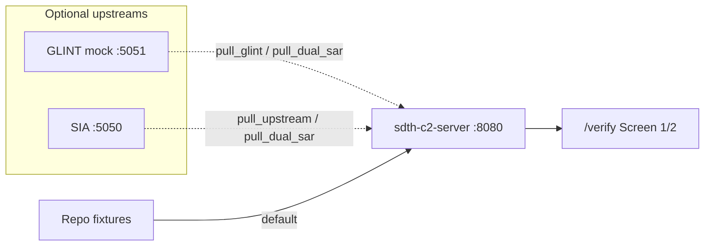

# End-to-end verification (NexusGate)

How to rehearse **Picture → Gate → Ack** locally with `/verify` (Jinja2/HTMX on Core).  
Not the external BattlePlan pitch UI. Contract: [C2 REST API](api/rest.md) · UI: [Demo Path F](demo.md#demo-path-f-nexusgate-verification-webui-phase-2--issue-65-not-pitch-ui).

## Do you need an SIA server?

**No — not for the default E2E.** SIA is a **data / ingress source**, not a C2 dependency or database.

| Mode | SIA process on `:5050`? | What C2 uses |
|------|-------------------------|--------------|
| **Fixture (default / CI / venue primary)** | **Not required** | `tests/fixtures/sentinel_run_cv_sg_strait.json` via `use_sentinel_fixture` / Dual-SAR fixtures |
| **Live pull (optional)** | Yes — sibling `Sentinel-Imagery-Analysis` | `POST {SAR_UPSTREAM_URL}/api/run_cv/...`; if unreachable → same fixture (**fail-safe**) |

Same idea for GLINT: Assumed-mock fixture is enough; `uv run sdth-mock-glint` (`:5051`) is optional for a live pull demo.

C2 never stores AIS history — that stays in **SIA’s** SQLite when you run SIA. See [Data provenance](data-provenance.md) · [SAR pipeline](architecture/sar_pipeline.md).



---

## Minimal E2E (Core only — recommended)

One process. No Node, no SIA, no GLINT mock.

```bash
cd /path/to/sdth-nexus-c2
uv sync
uv run sdth-c2-server          # http://127.0.0.1:8080
```

Browser (two tabs):

| Tab | URL | Actions |
|-----|-----|---------|
| Screen 1 | http://127.0.0.1:8080/verify/command | **Propose** `S2` → **Approve** |
| Screen 2 | http://127.0.0.1:8080/verify/recipient | Wait for HTMX poll (2s) → **Ack** |

Optional on Screen 1 (still no SIA server):

- **Ingress Sentinel fixture** — SIA-shaped dark vessels from golden JSON  
- **Ingress Dual-SAR fixture** — GLINT macro × SIA micro from fixtures (evidence chips)

Hub: http://127.0.0.1:8080/verify

### Curl checklist (same loop)

```bash
export C2=http://127.0.0.1:8080
curl -sf -X POST "$C2/api/admin/reset" >/dev/null

# Optional SAR data (fixtures — no SIA server)
curl -sf -X POST "$C2/api/ingress/candidate-event" \
  -H 'content-type: application/json' -d '{"dual_sar":true}' | jq '{source,count}'

# Path F
PROP=$(curl -sf -X POST "$C2/api/gate/proposals" \
  -H 'content-type: application/json' \
  -d '{"scenario_id":"S2","unit_id":"CUE-NODE-01"}')
COA=$(echo "$PROP" | jq -r '.coa.coa_id')
echo "$PROP" | jq '{amber: .finding.amber_alert, coa_id: .coa.coa_id}'

curl -sf -X POST "$C2/api/gate/approve" \
  -H 'content-type: application/json' \
  -d "{\"coa_id\":\"$COA\",\"decision\":\"y\",\"operator_id\":\"e2e\"}" | jq .status

curl -sf "$C2/api/recipient/inbox?unit_id=CUE-NODE-01" | jq '{count, coa: .taskings[0].coa.coa_id}'

curl -sf -X POST "$C2/api/recipient/ack" \
  -H 'content-type: application/json' \
  -d "{\"coa_id\":\"$COA\",\"unit_id\":\"CUE-NODE-01\",\"status\":\"ACKED\"}" | jq .status
```

Expect: amber `COUNT_AND_BEARING_MISMATCH` → `APPROVED` → inbox count `1` → `ACKED`.

---

## Optional: live GLINT mock

```bash
# Terminal A
uv run sdth-c2-server

# Terminal B
uv run sdth-mock-glint    # http://127.0.0.1:5051
```

```bash
curl -sf -X POST http://127.0.0.1:8080/api/ingress/candidate-event \
  -H 'content-type: application/json' -d '{"pull_glint":true}' | jq '{source,count}'
# source=glint when mock is up; otherwise glint_fixture
```

---

## Optional: live SIA sibling (not required for E2E)

Only if you want a real `run_cv` HTTP pull instead of the recorded fixture.

```bash
# Terminal A — sibling checkout (not a git submodule)
cd ~/work/Sentinel-Imagery-Analysis
uv sync && uv run sia-server   # default http://127.0.0.1:5050

# Terminal B
export SAR_UPSTREAM_URL=http://127.0.0.1:5050
export SAR_UPSTREAM_SCAN=<scan_folder>
uv run sdth-c2-server
```

```bash
curl -sf -X POST http://127.0.0.1:8080/api/ingress/candidate-event \
  -H 'content-type: application/json' -d '{"pull_upstream":true}' | jq '{source,count}'
# source=upstream when SIA is up; fixture when down (fail-safe)
```

Dual-SAR live pull (GLINT + SIA, each with its own fail-safe):

```bash
curl -sf -X POST http://127.0.0.1:8080/api/ingress/candidate-event \
  -H 'content-type: application/json' -d '{"pull_dual_sar":true}' | jq '{source,count}'
```

---

## What “pass” looks like

| Check | Pass |
|-------|------|
| Hub | `/verify` shows **NexusGate Verify** |
| S2 loop | Propose → Approve → Screen 2 Ack within a few seconds |
| Dual-SAR fixture | `source=dual_sar`, evidence under `/static/fixtures/` |
| SIA down | `pull_upstream` / `pull_dual_sar` still **200** via fixture |
| Invariant | UI never seals tokens — only `POST /api/gate/approve` |

Stop Core with Ctrl+C in the `sdth-c2-server` terminal.
