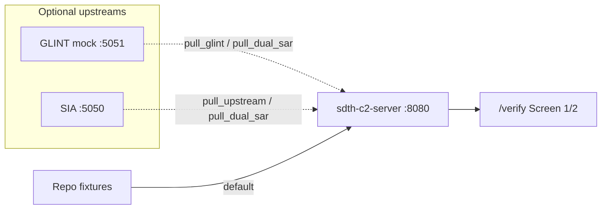

# End-to-end verification (NexusGate)

How to rehearse **Picture → Gate → Ack** locally with `/verify` (Jinja2/HTMX on Core) or the external **ARCHVIEW** tactical console ([Path ARCHVIEW](#path-archview-hero-s3--issue-99)).  
`/verify` is not the pitch UI. Contract: [C2 REST API](api/rest.md) · Path F: [Demo Path F](demo.md#demo-path-f-nexusgate-verification-webui-phase-2--issue-65-not-pitch-ui) · Path G: [Demo Path G](demo.md#demo-path-g-archview-tactical-console-issue-99).

## Do you need an SIA server?

**No — not for the default E2E.** SIA is a **data / ingress source**, not a C2 dependency or database.

| Mode | SIA process on `:5050`? | What C2 uses |
|------|-------------------------|--------------|
| **Fixture (default / CI / venue primary)** | **Not required** | `tests/fixtures/sentinel_run_cv_sg_strait.json` via `use_sentinel_fixture` / Dual-SAR fixtures |
| **Live pull (optional)** | Yes — sibling `Sentinel-Imagery-Analysis` | `POST {SAR_UPSTREAM_URL}/api/run_cv/...`; if unreachable → same fixture (**fail-safe**) |

Same idea for GLINT: Assumed-mock fixture is enough; `uv run sdth-mock-glint` (`:5051`) is optional for a live pull demo.

C2 never stores AIS history — persistent data is decoupled to **Indago** (DuckDB) and **SIA’s** SQLite. C2 consumes current tracks via adapters. See [Data provenance](data-provenance.md) · [SAR pipeline](architecture/sar_pipeline.md).



---

## Minimal E2E (Core only — recommended)

One process. No Node, no SIA, no GLINT mock.

```bash
cd /path/to/sdth-nexus-c2
uv sync
uv run sdth-c2-server          # http://127.0.0.1:8080
```

Browser (two tabs):

| Tab | URL | Actions |
|-----|-----|---------|
| Screen 1 | http://127.0.0.1:8080/verify/command | **Propose** `S3` (default / maritime hero) → **Approve** |
| Screen 2 | http://127.0.0.1:8080/verify/recipient | Wait for HTMX poll (2s) → **Ack** |

Optional on Screen 1 (still no SIA server):

- **Ingress SIA only** — Sentinel fixture (OBB + chip, ~2 dark vessels)
- **Ingress GLINT only** — Assumed-mock fixture (macro cluster; use **GLINT pull** if mock `:5051` is up)
- **Ingress Dual-SAR (both)** — fused composite (`source_id=DUAL_SAR`, confidence boost, keeps SIA geometry)
- **Ingress Indago AIS** — open-feed background traffic (Indago DuckDB → live → fixture; flash shows `source=`)
- **Reset** — clear runtime between mode compares

Hub: http://127.0.0.1:8080/verify

### Tamper detection rehearsal (#88)

After a closed loop (Propose → Approve → Ack), show that a 1-character edit of the sealed OCSF trail is caught. Requires the demo gate:

```bash
export C2_DEMO_TAMPER=1
uv run sdth-c2-server
```

On any `/verify` screen, the **Audit integrity** panel shows `OCSF Hash Chain: broken links 0 of n` and three actions:

1. **Inject 1-char tamper** — flips one character in a sealed record (same semantics as `scripts/demo_tamper_detection.py`); pill turns warn (`hash mismatch @ record[i]`).
2. **Re-verify** — re-walks the SHA-256 chain; when an EDS sidecar is present, also runs out-of-process `eds audit verify-chain` (`CHAIN_VALID` / fail).
3. **Restore** — writes back the pre-tamper snapshot; status returns to `0 of n`.

Never claim “100% integrity” — always report broken-link counts (KPI #5). CLI-only equivalent: `uv run python scripts/demo_tamper_detection.py`.

### Macro vs micro SAR — when to use which

Both feeds are **space-based SAR**, but they answer different operator questions. Full architecture: [SAR Pipeline §2.3 Dual-SAR Synergy](architecture/sar_pipeline.md#23-dual-sar-synergy-temporal-kinematic-bridge). Provenance / pitch roles: [Data provenance](data-provenance.md) (GLINT = S3 **macro**, SIA = S3 **micro**) · [Scenarios S3](scenarios.md).

| Source | Viewpoint | Typical product | Use alone when… |
|--------|-----------|-----------------|-----------------|
| **GLINT** (Team 02) | **Macro** — corridor / sector scene-difference | Cluster alert (`…_CLUSTER`), bbox over a wide area, no vessel length / chip | Cueing: “something anomalous in sector B” before micro detail exists, or partner live demo without SIA |
| **SIA** (in-house) | **Micro** — per-vessel metrology | Dark-vessel OBB (length, beam, angle) + evidence chip; optional AIS dark filter upstream | Tasking geometry / chip proof, or GLINT unavailable (Dual-SAR fail-safe is SIA-shaped) |
| **Dual-SAR** (both) | Macro cue **corroborated by** micro metrology | Composite `source_id=DUAL_SAR`, `dual=corroborated`, SIA geometry + boosted confidence | Default **hero / gate** narrative: operator sees *why* the cluster is actionable |

**How to choose on `/verify`:**

1. **GLINT only** — show the macro cue in isolation (Ontology: 1 cluster row, no chip).
2. **SIA only** — show micro detections without fusion (2 vessels + lengths + chip).
3. **Dual-SAR (both)** — preferred for Path F / S3 story: same micro geometry as SIA, plus `dual=corroborated` and higher confidence when macro and micro align spatially (≤3 km / macro bbox). If macro cannot load or does not overlap, Dual-SAR degrades toward SIA-only (`sia_only`) — see §2.3.

Do **not** treat the two sources as interchangeable duplicates: stacking GLINT + SIA without Dual-SAR leaves two unfused observations; Dual-SAR is the intentional joint path (`dual_sar` / `pull_dual_sar` on [REST candidate-event](api/rest.md)).

### Compare SAR ingress modes (results must differ)

Use this checklist to confirm SIA-only / GLINT-only / Dual-SAR are **observably different** on Screen 1. Core only; no SIA or GLINT process required.

1. Open http://127.0.0.1:8080/verify/command (hard-refresh if the server was already running).
2. For **each** row below: click **Reset** → click the ingress button → read **Ontology snapshot** and **Evidence chips**.
3. Do **not** stack modes without Reset — observations accumulate and blur the compare.

| Step | Button | Expect in Ontology | Evidence chips | Flash / provenance |
|------|--------|--------------------|----------------|--------------------|
| A | **Ingress SIA only** | **2** rows · `source_id=SENTINEL_IMAGERY_ANALYSIS` · `ingress=sentinel_imagery` · `L=78.2m` and `L=52.0m` · conf ≈ **0.91 / 0.84** · hint `UNANNOUNCED_DARK_VESSEL` | **Yes** — `sentinel_chip.jpg` | `SIA only … source=fixture` |
| B | **Ingress GLINT only** | **1** row · `source_id=SPACE_SAR_SCENE_DIFF` · `ingress=glint` · **no** `L=` length · `n≈2` · conf ≈ **0.88** · hint `…_CLUSTER` | **No** (macro fixture has no chip) | `GLINT only (fixture) … source=glint_fixture` |
| C | **Ingress Dual-SAR (both)** | **2** rows · `source_id=DUAL_SAR` · `ingress=dual_sar` · `dual=corroborated` · same lengths as SIA · conf ≈ **0.98** (boosted) | **Yes** — same SIA chip | `Dual-SAR … source=dual_sar` |

**Pass when all of the following hold:**

- Observation **count** changes: SIA=2, GLINT=1, Dual-SAR=2.
- **`source_id` / `ingress`** strings differ per mode (never mix labels after a proper Reset).
- Dual-SAR shows **`dual=corroborated`** and **higher confidence** than the matching SIA rows; GLINT alone never shows `dual=` or vessel length.
- Evidence chips appear for SIA and Dual-SAR, and stay empty for GLINT-only.

Optional curl equivalent (same Reset-between-modes rule via `/api/admin/reset`):

```bash
export C2=http://127.0.0.1:8080

# A — SIA fixture
curl -sf -X POST "$C2/api/admin/reset" >/dev/null
curl -sf -X POST "$C2/api/ingress/candidate-event" \
  -H 'content-type: application/json' -d '{"use_sentinel_fixture":true}' \
  | jq '{source,count,ids:[.observations[].source_id],ingress:[.observations[].attributes.ingress]}'

# B — GLINT fixture
curl -sf -X POST "$C2/api/admin/reset" >/dev/null
curl -sf -X POST "$C2/api/ingress/candidate-event" \
  -H 'content-type: application/json' -d '{"use_glint_fixture":true}' \
  | jq '{source,count,ids:[.observations[].source_id],ingress:[.observations[].attributes.ingress]}'

# C — Dual-SAR fixture
curl -sf -X POST "$C2/api/admin/reset" >/dev/null
curl -sf -X POST "$C2/api/ingress/candidate-event" \
  -H 'content-type: application/json' -d '{"dual_sar":true}' \
  | jq '{source,count,ids:[.observations[].source_id],dual:[.observations[].attributes.dual_sar_status],conf:[.observations[].confidence]}'
```

Expect curl: A `count=2` + `SENTINEL_IMAGERY_ANALYSIS`; B `count=1` + `SPACE_SAR_SCENE_DIFF`; C `count=2` + `DUAL_SAR` + `corroborated` + conf near `0.98`.

**Ingress GLINT pull** (optional): with `uv run sdth-mock-glint` on `:5051`, flash/source should say live `glint`; with mock down, fail-safe still returns the same Ontology shape as **GLINT only** (`glint_fixture`).

### Curl checklist (same loop)

```bash
export C2=http://127.0.0.1:8080
curl -sf -X POST "$C2/api/admin/reset" >/dev/null

# Optional SAR data (fixtures — no SIA server)
curl -sf -X POST "$C2/api/ingress/candidate-event" \
  -H 'content-type: application/json' -d '{"dual_sar":true}' | jq '{source,count}'

# Path F (S3 maritime hero — default)
PROP=$(curl -sf -X POST "$C2/api/gate/proposals" \
  -H 'content-type: application/json' \
  -d '{"scenario_id":"S3","unit_id":"CUE-NODE-01"}')
COA=$(echo "$PROP" | jq -r '.coa.coa_id')
echo "$PROP" | jq '{amber: .finding.amber_alert, threat: .finding.threat_class, coa_id: .coa.coa_id}'

curl -sf -X POST "$C2/api/gate/approve" \
  -H 'content-type: application/json' \
  -d "{\"coa_id\":\"$COA\",\"decision\":\"y\",\"operator_id\":\"e2e\"}" | jq .status

curl -sf "$C2/api/recipient/inbox?unit_id=CUE-NODE-01" | jq '{count, coa: .taskings[0].coa.coa_id}'

curl -sf -X POST "$C2/api/recipient/ack" \
  -H 'content-type: application/json' \
  -d "{\"coa_id\":\"$COA\",\"unit_id\":\"CUE-NODE-01\",\"status\":\"ACKED\"}" | jq .status
```

Expect: amber `SAR_DARK_CLUSTER_VS_AIS_SILENCE` / `APPROACH_PATROL` → `APPROVED` → inbox count `1` → `ACKED`.  
(S2 non-pitch stretch still works with `"scenario_id":"S2"` → `COUNT_AND_BEARING_MISMATCH`.)

---

## Path ARCHVIEW (Hero S3 — issue #99) {#path-archview-hero-s3--issue-99}

Pitch closed loop via the external **ARCHVIEW** Screen-1 console ([`johnnyteoh8888/SDTH-2026`](https://github.com/johnnyteoh8888/SDTH-2026)) into Core seal/OCSF and Screen-2 Ack. Same frozen REST as Path A / Path F. Proposal Step 3: [ARCHVIEW integration](archview-integration-proposal.md). Demo entry: [Path G](demo.md#demo-path-g-archview-tactical-console-issue-99).

### Split of ownership

| Half | Owner | Process |
|------|-------|---------|
| **Screen 1** | ARCHVIEW (external) | Vite `127.0.0.1:3001` — Propose S3, Amber, Evidence, Approve, audit pill |
| **Core** | This repo | `sdth-c2-server` `:8080` — ingress, gate, `DecisionToken` seal, OCSF |
| **Screen 2** | Abort path (default) | `/verify/recipient` **or** curl inbox/ack — **not** RasPi (demo-excluded) |

ARCHVIEW has **no Dual-SAR ingress button** — run fixture ingress on Core (curl) before Propose. Proxy / CORS: [REST · ARCHVIEW connection](api/rest.md#archview-connection). Types: [`archview-types.ts`](api/archview-types.ts).

### Prerequisites

| Process | Port | Start |
|---------|------|-------|
| NexusGate Core | `:8080` | `uv run sdth-c2-server` (this repo) |
| ARCHVIEW Vite | `:3001` | Sibling checkout; `npm run dev` (path-split proxy → Core; evidence BFF stays `:3102`) |
| ARCHVIEW evidence BFF | `:3102` | `npm run dev:api` or `npm start` as required by ARCHVIEW INSTALL |
| Screen 2 (abort) | same Core | Browser tab `/verify/recipient` **or** curl (below) |

```bash
# Terminal A — Core
cd /path/to/sdth-nexus-c2
uv sync
uv run sdth-c2-server          # http://127.0.0.1:8080

# Terminal B — ARCHVIEW (sibling checkout; not a submodule)
cd /path/to/SDTH-2026
npm ci                         # first time
npm run dev:api &              # evidence BFF :3102 (if not already up)
npm run dev                    # http://127.0.0.1:3001
```

Do **not** replace ARCHVIEW’s `/api` → BFF proxy wholesale — Core routes are path-split (`/api/ontology`, `/api/gate`, `/api/audit`, `/api/recipient`, `/api/ingress`, `/static/fixtures`).

### Checklist (Hero S3)

1. **Reset (optional):** `curl -sf -X POST http://127.0.0.1:8080/api/admin/reset`
2. **Ingress Dual-SAR (+ optional coastal):**
   ```bash
   curl -sf -X POST http://127.0.0.1:8080/api/ingress/open-feed \
     -H 'content-type: application/json' -d '{"feed":"all","use_fixture":true}'
   curl -sf -X POST http://127.0.0.1:8080/api/ingress/candidate-event \
     -H 'content-type: application/json' -d '{"dual_sar":true}' | jq '{source,count}'
   # Expect: source=dual_sar, count=2
   ```
   (Same hops work through the Vite proxy: `http://127.0.0.1:3001/api/ingress/...`.)
3. **ARCHVIEW — conflicting picture + Amber:** open `http://127.0.0.1:3001/` → scenario **S3 maritime hero** → **Propose**. Expect Amber `SAR_DARK_CLUSTER_VS_AIS_SILENCE`, COA `APPROACH_PATROL`, map/ontology tracks from Core.
4. **Operator Approve:** review Evidence Inspector chips → **Approve** on the HITL card **within the window** (console shows `timeout` — often ~5s; if expired, **Propose** again then Approve immediately). Core alone seals `DecisionToken` and appends OCSF (`POST /api/gate/approve`).
5. **Screen 2 Ack (abort default):**
   - **Browser:** `http://127.0.0.1:8080/verify/recipient` → wait HTMX poll → **Ack**, **or**
   - **curl:**
     ```bash
     COA=<coa_id from Propose>
     curl -sf "http://127.0.0.1:8080/api/recipient/inbox?unit_id=CUE-NODE-01" | jq '{count}'
     curl -sf -X POST http://127.0.0.1:8080/api/recipient/ack \
       -H 'content-type: application/json' \
       -d "{\"coa_id\":\"$COA\",\"unit_id\":\"CUE-NODE-01\",\"status\":\"ACKED\"}" | jq .status
     ```
6. **ARCHVIEW audit pill:** after Ack, pill shows verified (`GET /api/audit/health` → `verified: true`, `broken: 0`, label `0 of n`).

### Abort (RasPi unavailable)

Accepted split for Demo Day:

| Role | Path |
|------|------|
| Screen 1 | **ARCHVIEW only** (Propose / Approve / audit pill) |
| Screen 2 | `/verify/recipient`, Path A curl, **or** Core half of `SCENARIO=S3 ./scripts/picture_to_tasking.sh` after ARCHVIEW Approve |

~~Raspberry Pi 5 GPIO blink (#20)~~ remains **excluded from the demo path**. Optional stretch only: `RASPI_ACK_BLINK=1` (see [demo.md](demo.md)).

### Proxy-only smoke (no browser clicks)

With Core + Vite up:

```bash
# From ARCHVIEW checkout
npm run smoke:nexusgate
# Expect: smoke:nexusgate OK · audit health verified
```

Full curl closed loop through the Vite proxy (Screen-1 hops) + Core Ack (Screen-2 abort):

```bash
export C2=http://127.0.0.1:3001   # ARCHVIEW Vite → Core path-split
curl -sf -X POST http://127.0.0.1:8080/api/admin/reset >/dev/null
curl -sf -X POST "$C2/api/ingress/candidate-event" \
  -H 'content-type: application/json' -d '{"dual_sar":true}' | jq '{source,count}'
PROP=$(curl -sf -X POST "$C2/api/gate/proposals" \
  -H 'content-type: application/json' \
  -d '{"scenario_id":"S3","unit_id":"CUE-NODE-01"}')
COA=$(echo "$PROP" | jq -r '.coa.coa_id')
echo "$PROP" | jq '{amber: .finding.amber_alert, intent: .coa.intent}'
curl -sf -X POST "$C2/api/gate/approve" \
  -H 'content-type: application/json' \
  -d "{\"coa_id\":\"$COA\",\"decision\":\"y\",\"operator_id\":\"archview-e2e\"}" | jq .status
curl -sf -X POST http://127.0.0.1:8080/api/recipient/ack \
  -H 'content-type: application/json' \
  -d "{\"coa_id\":\"$COA\",\"unit_id\":\"CUE-NODE-01\",\"status\":\"ACKED\"}" | jq .status
curl -sf "$C2/api/audit/health" | jq .
```

### What “pass” looks like (Path ARCHVIEW)

| Check | Pass |
|-------|------|
| Ingress | `source=dual_sar`, count `2` (fixture; coastal open-feed optional) |
| ARCHVIEW Amber | `SAR_DARK_CLUSTER_VS_AIS_SILENCE` + COA `APPROACH_PATROL` after Propose S3 |
| Approve | Core returns `APPROVED` + sealed `DecisionToken` digest |
| Screen 2 | Inbox count `1` → `ACKED` via `/verify/recipient` or curl |
| Audit pill | `verified: true`, `broken: 0`, label `0 of n` |
| Invariant | UI never seals tokens — only `POST /api/gate/approve` |

Browser UI E2E stays **local-only** (not CI). Contract/CORS coverage: `tests/integration/test_archview_contract_e2e.py` (#93).

---

## Optional: live GLINT mock

```bash
# Terminal A
uv run sdth-c2-server

# Terminal B
uv run sdth-mock-glint    # http://127.0.0.1:5051
```

```bash
curl -sf -X POST http://127.0.0.1:8080/api/ingress/candidate-event \
  -H 'content-type: application/json' -d '{"pull_glint":true}' | jq '{source,count}'
# source=glint when mock is up; otherwise glint_fixture
```

---

## Optional: live SIA sibling (not required for E2E)

Only if you want a real `run_cv` HTTP pull instead of the recorded fixture.

```bash
# Terminal A — sibling checkout (not a git submodule)
cd ~/work/Sentinel-Imagery-Analysis
uv sync && uv run sia-server   # default http://127.0.0.1:5050

# Terminal B
export SAR_UPSTREAM_URL=http://127.0.0.1:5050
export SAR_UPSTREAM_SCAN=<scan_folder>
uv run sdth-c2-server
```

```bash
curl -sf -X POST http://127.0.0.1:8080/api/ingress/candidate-event \
  -H 'content-type: application/json' -d '{"pull_upstream":true}' | jq '{source,count}'
# source=upstream when SIA is up; fixture when down (fail-safe)
```

Dual-SAR live pull (GLINT + SIA, each with its own fail-safe):

```bash
curl -sf -X POST http://127.0.0.1:8080/api/ingress/candidate-event \
  -H 'content-type: application/json' -d '{"pull_dual_sar":true}' | jq '{source,count}'
```

---

## Full-Spectrum S3 E2E Verification (All Components Mobilized)

This end-to-end rehearsal validates that **when every system component is simultaneously mobilized** in the maritime hero scenario (S3), NexusGate executes with zero-risk determinism, prevents over-fusion, and compresses operational cognitive load.

### 1. Mobilized Architecture

| Component | Operational State | Role in Full E2E |
|---|---|---|
| **Indago AIS** | Active (LaunchAgent, live Singapore Strait DuckDB) | Ingests 40 live background vessels via `open_feed` (`feed_source=indago:singapore.duckdb`) |
| **GLINT mock** (`:5051`) | Running (`sdth-mock-glint`) | Ingests live macro anomaly (`SPACE_SAR_SCENE_DIFF`) |
| **SIA** (`:5050`) | Intentionally Offline | Triggers automatic fail-safe fallback to high-res Sentinel-1 micro detection fixture (`SENTINEL_IMAGERY_ANALYSIS`) |
| **NexusGate C2** (`:8080`) | Running (`sdth-c2-server`) | Corroborates Dual-SAR, maintains modality separation, evaluates deterministic gate, and logs immutable audit |

### 2. Empirical Verification Results

#### Ingress & Spatial Entity Graph
- **Background AIS**: 40 vessels (`resolved_sources.ais=indago`) seamlessly layered into the operational picture.
- **Dual-SAR Corroboration**: `source=dual_sar`, `dual=corroborated`, confidence boosted to **0.98**, vessel metrology extracted ($L=78.2\text{ m}, 52.0\text{ m}$).
- **Evidence Chips**: High-resolution radar chips (`tests/fixtures/sentinel_chip.jpg`) attached to CandidateEvents.
- **Modality Separation**: Graph ingested **42 observations** across **14 tracks** without blending AIS and SAR contacts into hallucinated composite entities.

#### Gate Closed-Loop & Lead-Pursuit Tasking
- **Amber Warning Picture**: `SAR_DARK_CLUSTER_VS_AIS_SILENCE` (threat `lane_sar_ais_dark_cluster`).
- **Discrepancy Metrics**: Spatial mismatch **~4,973 m**, tactical warning time **~12 min**.
- **Deterministic COA**: `APPROACH_PATROL` dispatched to dynamic **lead-pursuit POI** (Point of Interception calculated by quadratic collision-course kinematics [#58](https://github.com/edgesentry/sdth-nexus-c2/issues/58)) rather than stale historical coordinates.
- **Human-in-the-Loop Gate**: Sealed `DecisionToken` generated upon Commander authorization (`approve`).
- **Closed-Loop Ack**: Field Effector acknowledges tasking (`ACKED`) within latency bounds.

#### Automation & Cryptographic Audit Proof
```text
picture_to_tasking S3: PASS
Picture→Ack: 0.005s | Approve→Ack: 0.003s
recipient_ack sealed; cryptographic audit chain intact (218+ links)
```

### 3. Operational Interpretation (Why Evaluators Care)

> **"SAR sees ship-like radar returns. AIS reports normal commercial traffic. Is this sea clutter, an AIS-silent dark vessel, or sensor latency?"**

NexusGate solves this operational dilemma across three decoupled tiers:
1. **Macro SAR (GLINT)** asks: *"Is there an anomaly in this corridor sector?"*
2. **Micro SAR × AIS (SIA)** asks: *"Is this specific radar return unannounced at satellite pass time ($T - \Delta t$)?"*
3. **Tactical C2 (NexusGate $\leftarrow$ Indago)** asks: *"How is live traffic moving now ($T \approx 0$), and what is the dynamic intercept POI?"*

**The cognitive outcome**: The operator never conducts manual cross-database joins or pixel comparisons. The decision space is compressed from *"analyze raw sensor streams"* to **"authorize the pre-correlated, mathematically verified Amber Warning Picture"**.

---

## What “pass” looks like

| Check | Pass |
|-------|------|
| Hub | `/verify` shows **MOSAIC C2 Verify** |
| S3 hero loop | Propose (default S3) → Approve → Screen 2 Ack within a few seconds |
| Path ARCHVIEW (#99) | Dual-SAR ingress → ARCHVIEW Propose S3 / Approve → Screen-2 Ack (abort) → audit pill verified — see [Path ARCHVIEW](#path-archview-hero-s3--issue-99) |
| Dual-SAR fixture | `source=dual_sar`, evidence under `/static/fixtures/` |
| SAR mode compare | After Reset: SIA (2 + length + chip) ≠ GLINT (1 + cluster, no chip) ≠ Dual-SAR (`DUAL_SAR` + `corroborated` + conf≈0.98) — see [Compare SAR ingress modes](#compare-sar-ingress-modes-results-must-differ) |
| SIA down | `pull_upstream` / `pull_dual_sar` still **200** via fixture |
| Invariant | UI never seals tokens — only `POST /api/gate/approve` |

Stop Core with Ctrl+C in the `sdth-c2-server` terminal.
